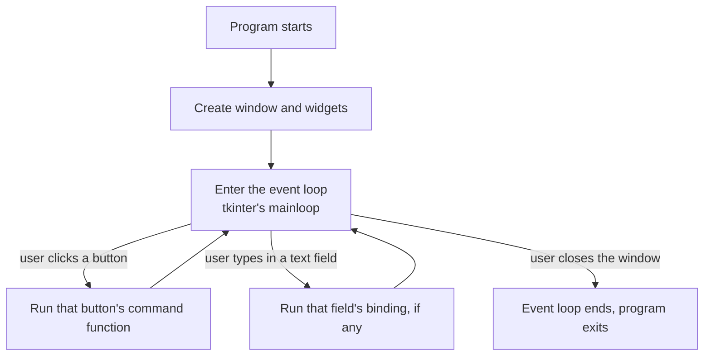

# 7.1. GUI programming with Tkinter — introduction

> Everything up to this chapter has produced text output in a terminal.
> This chapter and the next few build interactive windows instead —
> buttons, text fields, labels the user can actually click and type
> into. The examples stay **procedural on purpose**: functions, variables,
> `if`, lambdas, `result`, and `nullable` — no traits, no classes, no
> entities required. You already met `class` earlier in the book; here we
> deliberately keep the UI as **top-level statements** so the event loop
> and widgets stay easy to see — no `main` wrapper yet. Class-based GUIs
> show up later in examples such as the Pokemon TCG and database shop apps.

## 1. What makes a GUI program different

Every program so far has run top to bottom and finished: the file's
statements execute in order, and the process ends. A GUI program works
differently: it starts up, draws a window, and then **waits** — sitting
idle until the user does something (a click, a keypress), at which point
it runs a small piece of your code in response, then goes back to
waiting. This "wait, react, wait, react" cycle is called the **event
loop**, and it runs until the user closes the window.



This is why a GUI program's top-level code looks different from a short
console script: it does not contain your program's logic only as a
straight list of prints. It builds the window, tells the window which
functions to call for which events, and then hands control over to the
event loop. Your actual click/key logic runs later, in response to
events — not only as one pass from the first line to the last.

## 2. Tkinter

Tkinter is Python's built-in GUI library — it requires no separate
installation, which makes it a good starting point before anything more
elaborate. Typhon accesses it exactly the way it accesses any external
Python package: through `import`.

```typhon
import tkinter as tk

Tk window = tk.Tk()
window.title("My First Window")
window.geometry("300x150")

window.mainloop()
```

Run this, and an empty window titled "My First Window" appears, sized
300 pixels wide by 150 tall. The statements run top to bottom like any
other beginner program — there is no `main` function to call. Nothing
else happens yet inside the window — there are no widgets in it — but
the event loop is already running: try closing the window with the OS's
close button and notice the program actually exits; that's `mainloop()`
returning once the window closes.

> **Type names:** declare the window as `Tk`, not `tk.Tk`. The `tk.`
> prefix is for *calling* constructors (`tk.Tk()`); the type name itself
> is the short name brought in by the import alias.

### Walking through it

- `tk.Tk()` creates the main application window itself — every Tkinter
  program has exactly one of these, usually the very first thing built.
- `window.title(...)` and `window.geometry(...)` are configuration calls
  — they don't display anything by themselves, they set properties of the
  window object that already exists.
- `window.mainloop()` is the line that starts the event loop from §1.
  Everything after this call in the file will not run until the window is
  closed — this is a blocking call: you are waiting on user interaction.

### Exercise

> Change the window's title and size. Then try adding a second
> `window.geometry(...)` call with different numbers right after the
> first one, before `mainloop()` — predict which one wins, then run it
> to check.

---

[Previous: Passing functions around](chapter_5_3_passing_functions.md) · [Next: Widgets and layout](gui_widgets.md)
