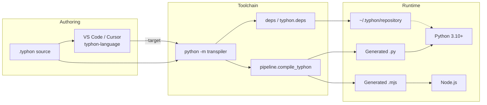
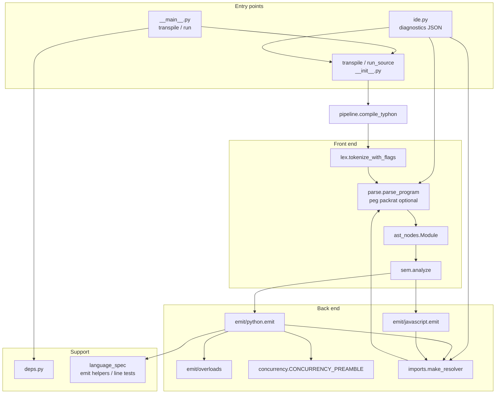
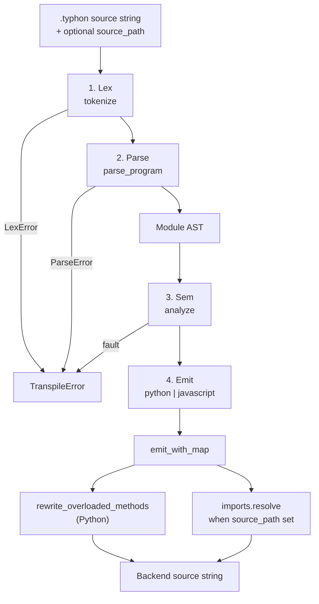
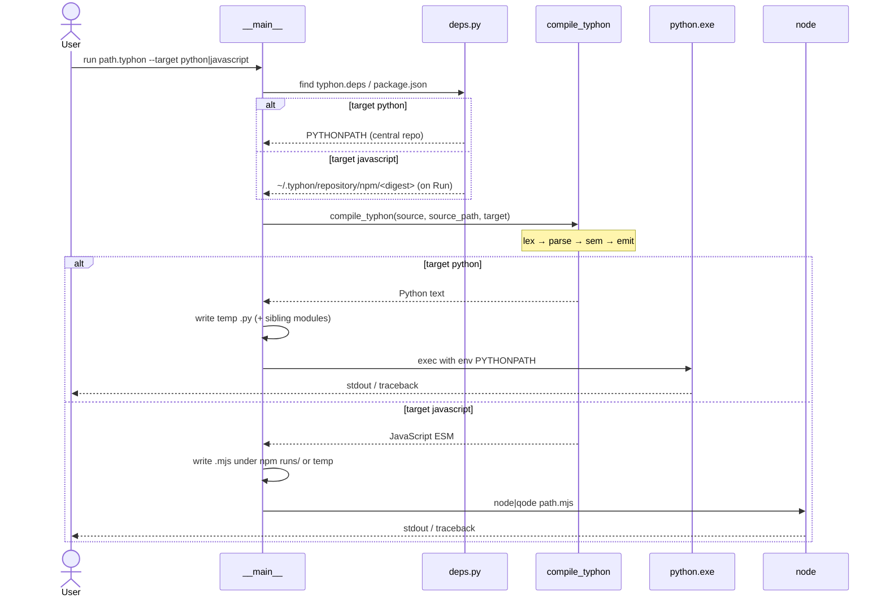
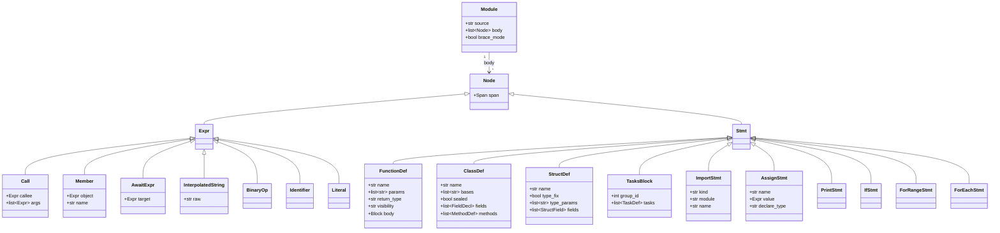
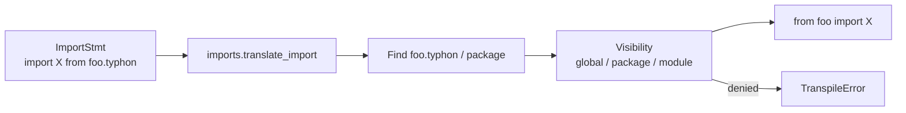
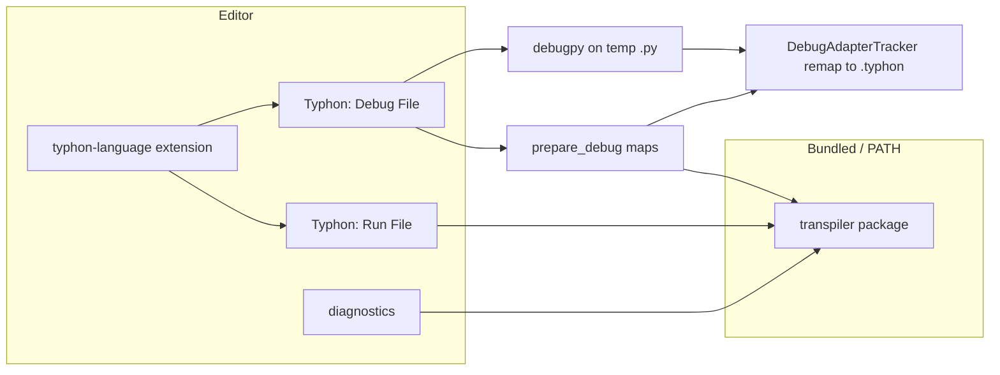

# Architecture

How the Typhon toolchain is structured and how a `.typhon` file becomes running
Python (reference) or JavaScript (Node MVP).

Related docs: [LANGUAGE.md](LANGUAGE.md) · [CONCURRENCY.md](CONCURRENCY.md) · [pipeline-migration.md](pipeline-migration.md) · [evolution/](evolution/README.md) (code CERs) · [adr/](adr/README.md) (ADRs) · [TODO-FUTURE.md](TODO-FUTURE.md) (deferred work)

---

## Big picture

Students edit `.typhon`. Run/transpile goes through the CLI (or the extension
wrapping it). Default emit target is **Python**; `--target javascript` emits
ESM for **Node** (MVP surface — [ADR-030](adr/ADR-030-javascript-emit-target.md)).
Dependencies are resolved from `typhon.deps` into a shared cache for the Python
backend; generated Python then runs with that `PYTHONPATH`.

---

## Component architecture

| Module | Role |
| --- | --- |
| `pipeline.py` | Orchestrates **lex → parse → sem → emit** (`target=`) |
| `lex.py` | Tokens with line/column spans |
| `parse.py` | Brace (and limited indent) recursive-descent → AST |
| `ast_nodes.py` | Target-neutral statements / expressions |
| `sem.py` | Semantic checks on the AST (types, access, tasks, arrays, …) |
| `emit/python.py` | Python text from AST (reference backend) |
| `emit/javascript.py` | JavaScript (ESM) MVP from AST — [ADR-030](adr/ADR-030-javascript-emit-target.md) |
| `npm_deps.py` | `package.json` → central `~/.typhon/repository/npm/<digest>` (Run-time install) |
| `emit/overloads.py` | Post-pass arity dispatch for overloaded methods (Python) |
| `concurrency.py` | Shared tasks/await/shared/atomic preamble (Python) |
| `imports.py` | AST-based `.typhon` import resolution / visibility |
| `deps.py` | `typhon.deps` → `~/.typhon/repository` (Python run path) |
| `transpiler.py` | Public `transpile` / `run_source` / `TranspileError` |
| `language_spec.py` | Shared string helpers for emit; `LANGUAGE.translate_line` tests |
| `ide.py` | Go-to-definition / diagnostics via AST pipeline |

---

## Compiler pipeline (process)

### Stage details

1. **Lex** — Reject illegal tokens early (e.g. tabs).
2. **Parse** — Prefer brace mode when `{`/`}` are present. Indent-mode (`then` / `func` / `repeat`) only when there are no braces. Failures raise `TranspileError` (no legacy fallback).
3. **Sem** — Owns language rules on the AST: `let`, bindings, const/fix, loop counters, typed interpolation, member access, sealed/interfaces, shared/atomic capture (Policy B), arrays, class modifiers, await placement/cycles, import-name access when `source_path` is set. Target-neutral (not rewritten per backend).
4. **Emit** — Walk AST to Python (reference) or JavaScript MVP; inject concurrency preamble and ABC/array imports as needed on Python; resolve `.typhon` imports via `ImportResolver`; rewrite method overloads (Python).

---

## Run vs transpile (sequence)

`transpile` stops after `compile_typhon` and writes the requested `.py` or `.mjs` file (no execute).

---

## AST shape (UML)

High-level view of the module tree the parser produces and sem/emit consume:

---

## Import resolution

When `source_path` is set, emit and sem share the AST-based imports facade:

Sibling `.typhon` metadata is loaded with `parse_program` + `module_info_from_ast` (exports, sealed, class graph). No legacy `Parser` on this path.

---

## Extension ↔ transpiler

The extension packages a copy of the transpiler (`npm run prepare`). Diagnostics and Run share the same front-end rules as `compile_typhon` where possible. Debug prepares generated modules + line maps and remaps breakpoints/stack frames to `.typhon` ([ADR-014](adr/ADR-014-pys-dap-stepping.md)).
---

## Extending the pipeline

| Goal | Touch |
| --- | --- |
| New syntax | `lex` → `parse` → `ast_nodes` → `sem` (if checked) → `emit/python` (+ `emit/javascript` MVP when in scope) · update `docs/language.ebnf` |
| New semantic rule | Prefer `sem.py` + tests under `tests/test_sem.py` |
| New backend | Add `emit/<target>.py` and a `target=` branch in `pipeline.compile_typhon` (JS MVP: [ADR-030](adr/ADR-030-javascript-emit-target.md); Java/C# still open) |
| New dependency behavior | `deps.py` + `typhon.deps` docs in the README |

Characterization goldens: `tests/golden/` (regen only via `python tests/golden/regen.py`).

Why recent security and performance code moved the way it did (pre/post behavior,
not architecture diagrams): [`evolution/`](evolution/README.md).
System-level decisions: [`adr/`](adr/README.md). Both are project memory —
see `.cursor/rules/project-memory.mdc`.
