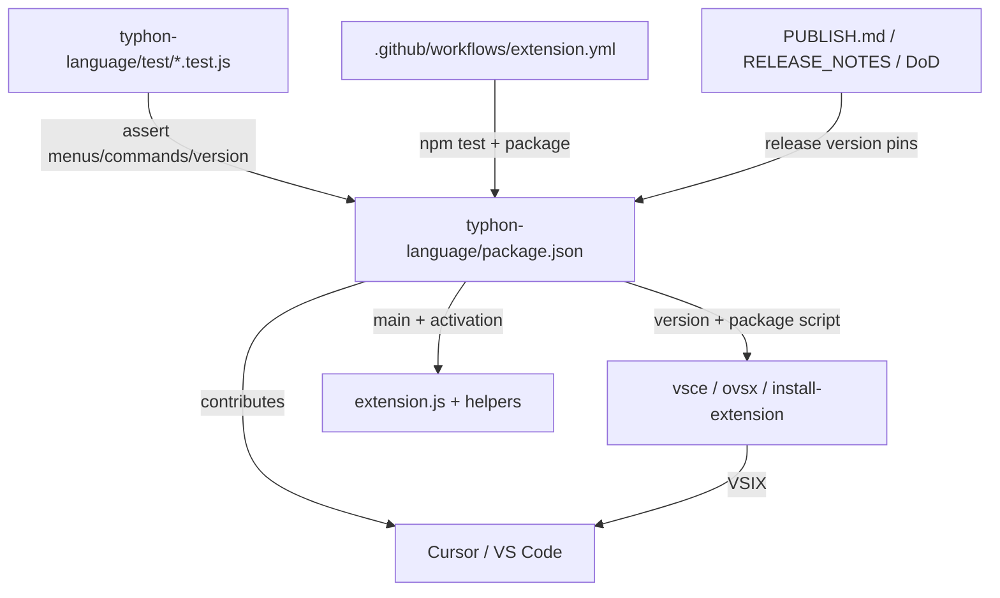

## Purpose

[`typhon-language/package.json`](typhon-language/package.json) is the **VS Code / Cursor extension manifest** for **Typhon Language Support**.

It does three jobs at once:

1. **Marketplace / VSIX identity** — name, version, publisher, icon, license (what gets packaged and published).
2. **Declarative product surface** — what the host shows *before* JS runs: language id, grammar, menus, settings, keybindings, commands list.
3. **npm package for the extension folder** — scripts (`package`, `test`, `prepare-bundle`) and tooling deps (`vsce`, `ovsx`).

It is **not** the transpiler’s Python package. Runtime behavior lives mainly in `extension.js` (+ helpers). This file **declares** what exists; JS **implements** it.

---

## Big parts (top → bottom)

### Identity & packaging
| Field | Role |
|--------|------|
| `name` / `displayName` / `publisher` / `version` | Extension id ≈ `remideboer.typhon-language`, Marketplace/VSIX naming (`typhon-language-0.0.101.vsix`) |
| `description`, `keywords`, `categories`, `icon` | Store listing / discovery |
| `repository` / `bugs` / `homepage` / `license` | Links + legal |
| `engines.vscode` | Minimum host API (`^1.80.0`) |
| `scripts` | `prepare-bundle` (copy transpiler into `bundled/`), `package` (vsce → `.vsix`), publish scripts, `test` |
| `devDependencies` | `@vscode/vsce`, `ovsx` for packaging/publish |

### Entry & activation
| Field | Role |
|--------|------|
| `main`: `./extension.js` | JS entry; host loads this after activation |
| `activationEvents` | When to load JS: open `.typhon` / markdown, run certain commands, sidebar, startup |

Until activation, **static** contributions (highlighting, menus, settings schema) still work; diagnostics/refactor need JS.

### `contributes` — the teaching IDE surface

This is the bulk of the file:

- **`configuration`** — Settings UI (`typhon.emitTarget`, `typhon.intellisense.enabled`, library nav, etc.). JS reads these via `vscode.workspace.getConfiguration('typhon')`.
- **`configurationDefaults`** — Default token colors for Typhon TextMate scopes (dark/light/HC) from `syntax-color-schemes.md`.
- **`typhon.syntaxColors.*`** (`format: color`) — Settings UI pickers; explicit values override those defaults (CER-061).
- **`viewsContainers` / `views` / `viewsWelcome`** — Activity-bar **Typhon** sidebar + “Create Project” welcome.
- **`languages`** — Registers language id `typhon` for `*.typhon`, points at `language-configuration.json` (brackets, comments).
- **`grammars`** — TextMate: `syntaxes/typhon.tmLanguage.json` + markdown fence injection.
- **`breakpoints`** — Allow breakpoints in `.typhon`.
- **`snippets`** — `snippets/typhon.code-snippets`.
- **`semanticTokenTypes` / `semanticTokenScopes`** — Extra highlighting types (e.g. `typhonType`); filled by providers in JS.
- **`markdown.*`** — Preview plugin flag + CSS for book-style fences.
- **`commands`** — Catalog of every `typhon.*` command (titles, icons, categories). **Must** match `registerCommand` in JS or the menu entry is dead.
- **`submenus`** — e.g. `typhon.refactor.more`.
- **`menus`** — *Where* commands appear and in what **order** (`group` like `0_run@1`):
  - `editor/context` — right-click (Run/Debug top, rename, extracts, …)
  - `editor/title`, `editor/title/run`, `editor/title/context`
  - `editor/lineNumber/context`, `explorer/context`
  - `debug/toolBar`, `view/title`, `commandPalette`
  - `typhon.refactor.more` — submenu contents
- **`keybindings`** — Shortcuts (Run/Debug, F2 → rename, …) with `when` clauses.

---

## What it needs (dependencies of this file)

**On disk next to it**

- `extension.js` (+ `refactor.js`, `debug-*.js`, …) — implementations of declared commands/providers  
- `syntaxes/*.json`, `language-configuration.json`, `snippets/`, `icons/`, `media/`  
- After `prepare-bundle`: `bundled/transpiler/` (copied from repo `transpiler/`)

**At package/publish time**

- Node + npm, `@vscode/vsce`  
- Bundled transpiler present (`npm run prepare` / `vscode:prepublish`)

**At runtime in the editor**

- Cursor/VS Code ≥ `engines.vscode`  
- Python (and Node if JS emit) on PATH for run/debug/analyze — not declared in this JSON; enforced in JS / prompts  

**Conceptually**

- Command ids in `commands` / `menus` / `keybindings` / `activationEvents` must stay in sync with JS  
- `when` clauses use host context keys (`resourceExtname`, `editorLangId`) plus custom ones set in JS (`typhon.hasMainFile`, `typhon.debugSessionActive`, …)

---

## What relies on this file

- **Editor host** — loads contributions; without this file there is no extension.  
- **`extension.js`** — assumes command ids, settings keys, language id `typhon`, view ids exist as declared.  
- **VSIX build** (`npm run package`, `install-extension.bat`, CI) — reads version/name/scripts.  
- **Marketplace / Open VSX** — publish uses this metadata.  
- **Tests** — e.g. `refactor.test.js`, `project-main.test.js`, `debug-mode.test.js` parse this JSON for menus/commands/keybindings.  
- **Release process** — DoD: bump `version` + `RELEASE_NOTES.md` together; CI/extension workflow packages from here.

---

## Mental model

Think of it as the **contract with the editor**:

| Layer | Owns |
|--------|------|
| `package.json` | *What* appears (menus, settings, language, shortcuts, command names) |
| `extension.js` (+ modules) | *What happens* when you click/run/analyze |
| Bundled `transpiler/` | *Language* semantics (parse/sem/emit) invoked by the IDE helpers |

Changing context-menu order = edit `contributes.menus["editor/context"]` `group` values here; changing rename *behavior* = edit `refactor.js` (and keep command id `typhon.refactor.rename` aligned with this file).