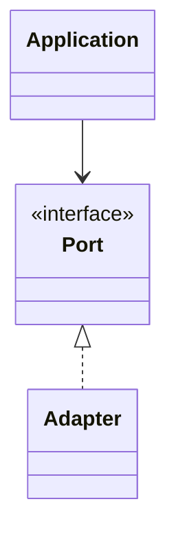
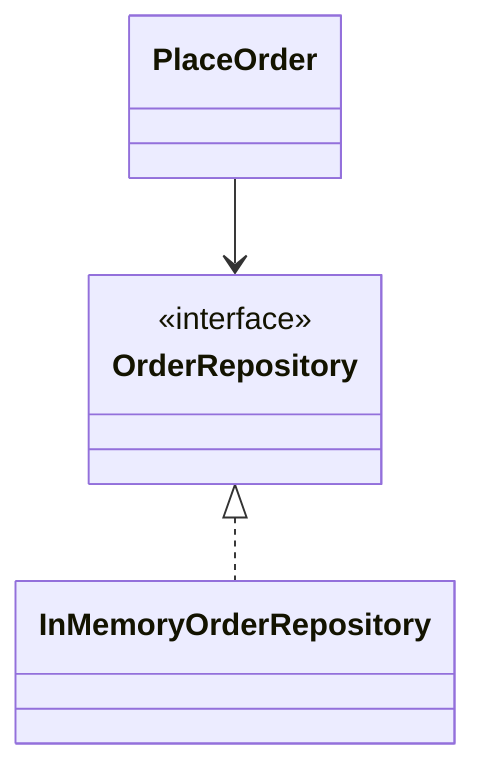

# Hexagonal architecture (ports and adapters)

**Category:** Architectural  
**Demo:** [hexagonal.typhon](hexagonal.typhon)  
**Wikipedia:** [Hexagonal architecture (software)](https://en.wikipedia.org/wiki/Hexagonal_architecture_%28software%29)

## Intent

Keep domain/application logic independent of delivery and storage by depending
only on **ports** (interfaces); **adapters** implement those ports.

## Explanation

`PlaceOrder` depends on `OrderRepository`. `InMemoryOrderRepository` is a
driven adapter. Larger living examples:
[`examples/database/`](../../database/), [`examples/rest-api/shop/`](../../rest-api/shop/).

## Classic structure (UML)



## This demo



## Real-world use cases

- Swap SQL for in-memory repos in tests.
- Same use-case driven by HTTP, CLI, or message adapters.

## Run

```text
python -m transpiler run examples/patterns/architectural/hexagonal.typhon
```
