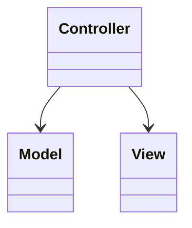
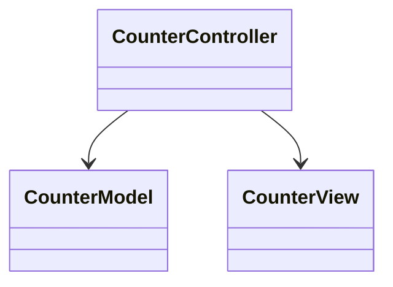

# Model–View–Controller (MVC)

**Category:** Architectural  
**Demo:** [mvc.typhon](mvc.typhon)  
**Wikipedia:** [Model–view–controller](https://en.wikipedia.org/wiki/Model%E2%80%93view%E2%80%93controller)

## Intent

Split interactive UI into **Model** (state), **View** (presentation), and
**Controller** (input → updates).

## Explanation

`CounterController` receives plus/minus, mutates `CounterModel`, then asks
`CounterView` to show the new value. The view does not own business rules.

## Classic structure (UML)



## This demo



## Real-world use cases

- Server-rendered web frameworks (Rails-style controllers).
- Desktop forms with a controller coordinating widgets and domain objects.

## Run

```text
python -m transpiler run examples/patterns/architectural/mvc.typhon
```
