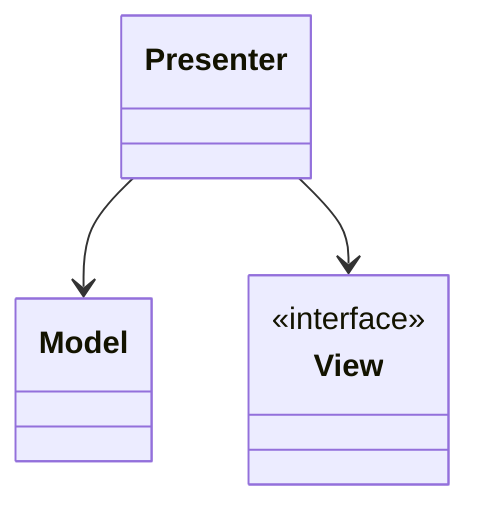
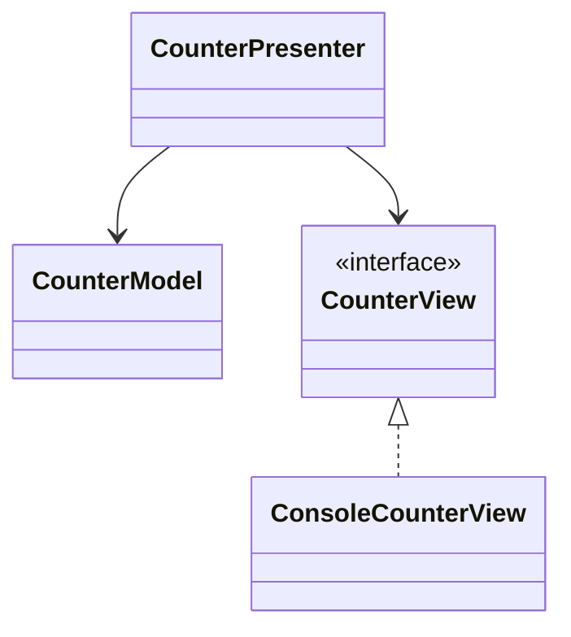

# Model–View–Presenter (MVP)

**Category:** Architectural  
**Demo:** [mvp.typhon](mvp.typhon)  
**Wikipedia:** [Model–view–presenter](https://en.wikipedia.org/wiki/Model%E2%80%93view%E2%80%93presenter)

## Intent

A **Presenter** drives a passive **View** through an interface; the View only
displays what it is told.

## Explanation

`CounterView` is an interface; `ConsoleCounterView` prints. The presenter owns
the flow — easier to swap or fake the view in tests.

## Classic structure (UML)



## This demo



## Real-world use cases

- Android / WinForms apps with passive views.
- UI tests that inject a fake view into the presenter.

## Run

```text
python -m transpiler run examples/patterns/architectural/mvp.typhon
```
