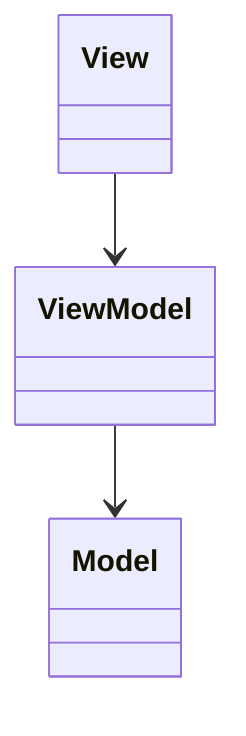
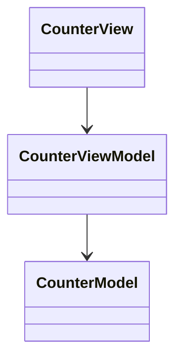

# Model–View–ViewModel (MVVM)

**Category:** Architectural  
**Demo:** [mvvm.typhon](mvvm.typhon)  
**Wikipedia:** [Model–view–viewmodel](https://en.wikipedia.org/wiki/Model%E2%80%93view%E2%80%93viewmodel)

## Intent

The **View** binds to a **ViewModel** that exposes display state and commands;
the ViewModel talks to the **Model**.

## Explanation

`CounterView` only calls ViewModel commands and reads `displayValue` — it never
touches `CounterModel`. Teaching form without a framework binder.

## Classic structure (UML)



## This demo



## Real-world use cases

- WPF / SwiftUI / Android data-binding UIs.
- SPAs where a view-model holds screen state separate from domain entities.

## Run

```text
python -m transpiler run examples/patterns/architectural/mvvm.typhon
```
