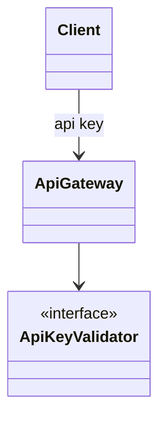
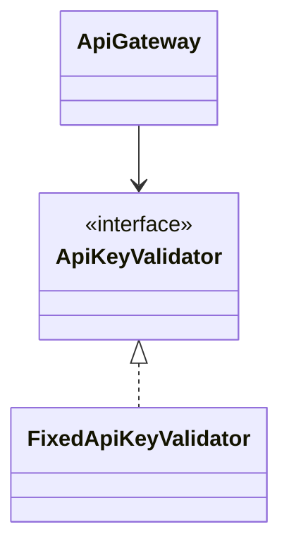

# API key authentication

**Category:** Authentication  
**Demo:** [api_key.typhon](api_key.typhon)  
**Wikipedia:** [Application programming interface key](https://en.wikipedia.org/wiki/Application_programming_interface_key)

## Intent

Authenticate a caller with a pre-shared **API key** on each request (no
interactive login).

## Explanation

`ApiGateway` depends on an `ApiKeyValidator` port. A fixed-key validator is
injected at construction. Invalid keys get `deny:`; valid keys get `ok:`.

## Classic structure (UML)



## This demo

`FixedApiKeyValidator` implements the port; `ApiGateway.handle` is the gate.



## Real-world use cases

- Public HTTP APIs for partners (key in header or query).
- Server-to-server webhooks with a shared secret.
- Rate-limited developer portals issuing per-app keys.

## Run

```text
python -m transpiler run examples/patterns/authentication/api_key.typhon
```
