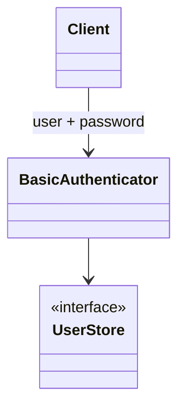
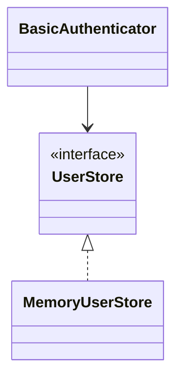

# HTTP Basic authentication

**Category:** Authentication  
**Demo:** [basic_auth.typhon](basic_auth.typhon)  
**Wikipedia:** [Basic access authentication](https://en.wikipedia.org/wiki/Basic_access_authentication)

## Intent

Prove identity with a **username and password** on the request (HTTP sends them
Base64-encoded in `Authorization: Basic …`).

## Explanation

`BasicAuthenticator` checks credentials against a `UserStore`. This demo takes
username and password as separate arguments — transport encoding is omitted so
the auth *decision* stays clear. Prefer HTTPS whenever Basic is used for real.

## Classic structure (UML)



## This demo

`MemoryUserStore` + `BasicAuthenticator` with constructor DI.



## Real-world use cases

- Simple device / legacy APIs over TLS.
- Quick internal tools before migrating to tokens or OAuth.
- Git / package registries that still accept Basic.

## Run

```text
python -m transpiler run examples/patterns/authentication/basic_auth.typhon
```
