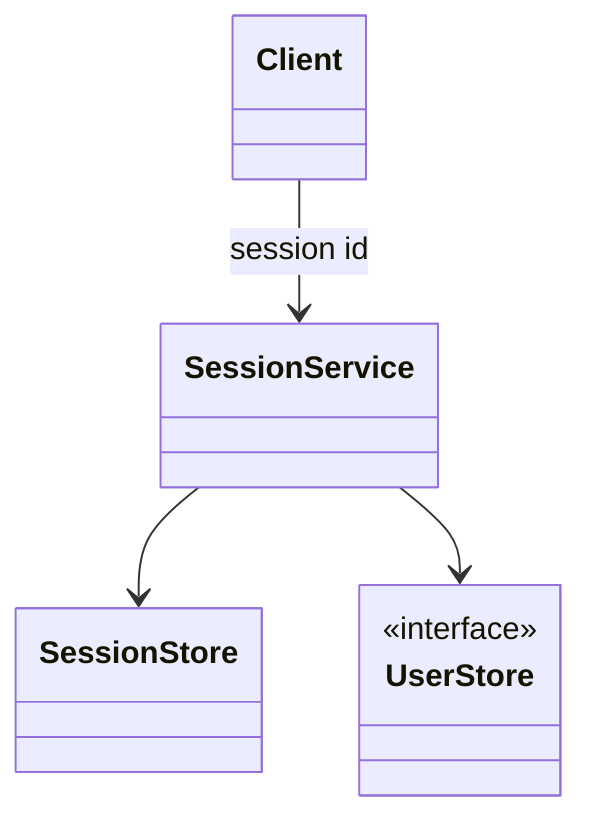
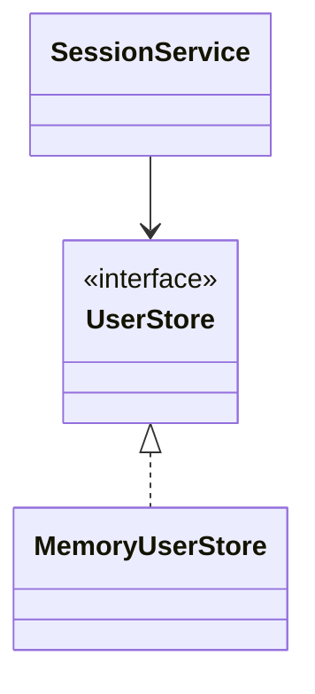

# Session-based authentication

**Category:** Authentication  
**Demo:** [session_based.typhon](session_based.typhon)  
**Wikipedia:** [Session](https://en.wikipedia.org/wiki/Session_%28computer_science%29) · [HTTP cookie](https://en.wikipedia.org/wiki/HTTP_cookie)

## Intent

After a successful login, issue an opaque **session id**; later requests prove
identity by presenting that id, which the server looks up in a session store.

## Explanation

`SessionService.login` checks credentials via a `UserStore` port, then stores
`sessionId → username`. `userFor` / `logout` read and clear the map. The client
holds only the id (classically in a cookie) — not the password.

## Classic structure (UML)



## This demo

`MemoryUserStore` implements `UserStore`; `SessionService` holds an in-memory
session map and is constructed with the store (DI).



## Real-world use cases

- Classic server-rendered web apps with session cookies.
- Admin consoles that keep a logged-in browser session.
- Shopping carts tied to an anonymous session before login.

## Run

```text
python -m transpiler run examples/patterns/authentication/session_based.typhon
```
