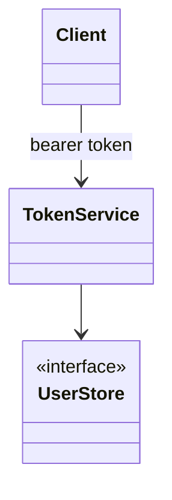
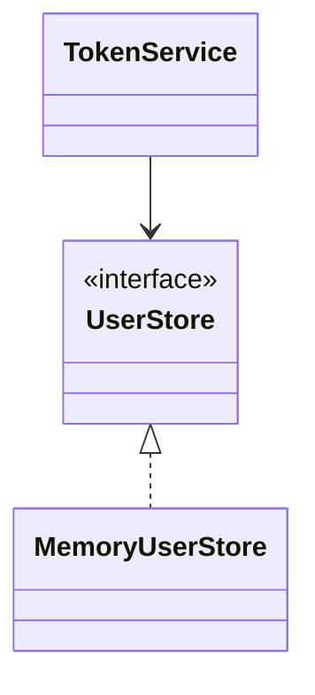

# Token-based authentication

**Category:** Authentication  
**Demo:** [token_based.typhon](token_based.typhon)  
**Wikipedia:** [Access token](https://en.wikipedia.org/wiki/Access_token) · [JSON Web Token](https://en.wikipedia.org/wiki/JSON_Web_Token)

## Intent

After login, issue a **bearer token**; later requests send that token; the server
validates it and resolves the user — without a sticky server session cookie.

## Explanation

This demo uses an **opaque** token stored server-side (same shape as a session
map). Production APIs often use **signed JWTs** (stateless). For a full HTTP
Bearer JWT shop, see [`examples/rest-api/shop/jwt/`](../../rest-api/shop/jwt/).

## Classic structure (UML)



## This demo

`TokenService` issues `tok-N` strings and maps them to usernames; `authenticate`
looks them up.



## Real-world use cases

- Mobile / SPA APIs with `Authorization: Bearer …`.
- Service-to-service calls with short-lived access tokens.
- JWTs carrying claims (roles, expiry) without a central session DB.

## Run

```text
python -m transpiler run examples/patterns/authentication/token_based.typhon
```
