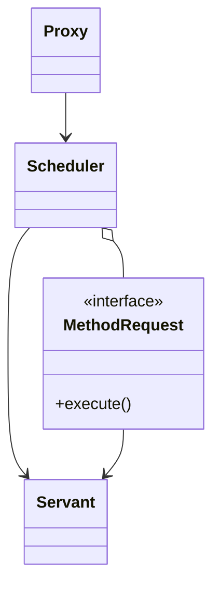
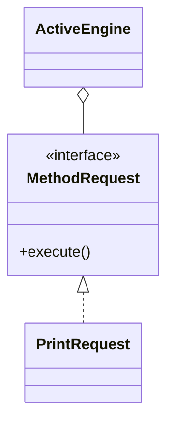

# Active object

**Category:** Concurrency  
**Demo:** [active_object.typhon](active_object.typhon)  
**Wikipedia:** [Active object](https://en.wikipedia.org/wiki/Active_object) · [Concurrency pattern](https://en.wikipedia.org/wiki/Concurrency_pattern)

## Intent

Decouple method execution from method invocation so that the object runs in its own thread of control.

## Explanation

Clients call `say`, which **enqueues** a `MethodRequest`. A servant (`pump`) executes requests later in its own `task`. There is no condition-wait for an empty queue — this demo drains a known queue after enqueue. Full Active Object often adds a scheduler and futures; Typhon stops short of wait/notify.

## Classic structure (UML)



## This demo

`ActiveEngine` is proxy + queue; `PrintRequest` is a method request; `pump` is the servant run inside `tasks`.



## Real-world use cases

- GUI toolkits posting work onto a single UI thread.
- Actor-style services that process a mailbox of messages.
- Hardware drivers that serialize device commands through one worker.

## Run

```text
python -m transpiler run examples/patterns/concurrency/active_object.typhon
```
