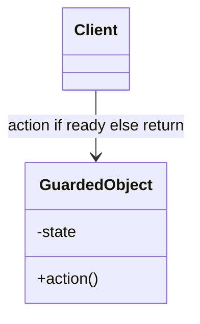
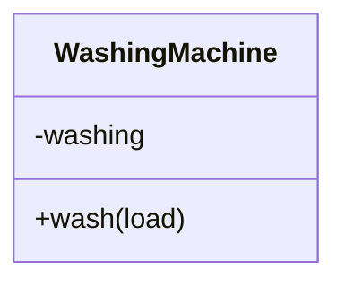

# Balking

**Category:** Concurrency  
**Demo:** [balking.typhon](balking.typhon)  
**Wikipedia:** [Balking pattern](https://en.wikipedia.org/wiki/Balking_pattern) · [Concurrency pattern](https://en.wikipedia.org/wiki/Concurrency_pattern)

## Intent

Execute an action only when the object is in an appropriate state; otherwise return immediately without waiting.

## Explanation

If the object is already busy (or otherwise not ready), the call **balks** — it does not queue or block. The demo shows a sequential `WashingMachine.wash` that refuses a second start while washing, then a concurrent CAS form where only one task enters and the others print `balk:`.

## Classic structure (UML)



## This demo

`WashingMachine` is the guarded object for the sequential case. Concurrent balking uses module-level `atomic int busy` with `compareAndSet` (Typhon has no monitor).



## Real-world use cases

- UI buttons that ignore clicks while a save is already in progress.
- Connecting to a device that is already connected — return “already open.”
- Starting a background job only when the previous one has finished.

## Run

```text
python -m transpiler run examples/patterns/concurrency/balking.typhon
```
