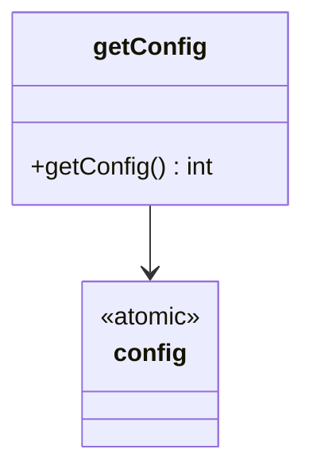

# Double-checked locking

**Category:** Concurrency  
**Demo:** [double_checked_locking.typhon](double_checked_locking.typhon)  
**Wikipedia:** [Double-checked locking](https://en.wikipedia.org/wiki/Double-checked_locking) · [Concurrency pattern](https://en.wikipedia.org/wiki/Concurrency_pattern)

## Intent

Reduce locking overhead for lazy initialization by checking a flag before and after acquiring the lock.

## Explanation

Classic DCL uses a mutex on the slow path. Typhon has **no lock**; this demo uses `atomic int` with a fast `get()` path and `compareAndSet(-1, computed)` so only one initializer wins. Losers re-read the published value. Prefer DI / eager init in application code; this is literacy for the classic pattern.

## Classic structure (UML)

```mermaid
classDiagram
    class Singleton {
        -instance
        +getInstance()
    }
    note for Singleton : check then lock then check again
```

## This demo

Module-level `atomic int config` starts at `-1`; `getConfig` double-checks via `get` + `compareAndSet`.



## Real-world use cases

- Lazy singleton or cache init once under concurrency (historically with locks).
- Publishing an expensive computed constant after a one-time race.
- Teaching why plain `if (x == null) x = new …` is unsafe without atomics/locks.

## Run

```text
python -m transpiler run examples/patterns/concurrency/double_checked_locking.typhon
```
