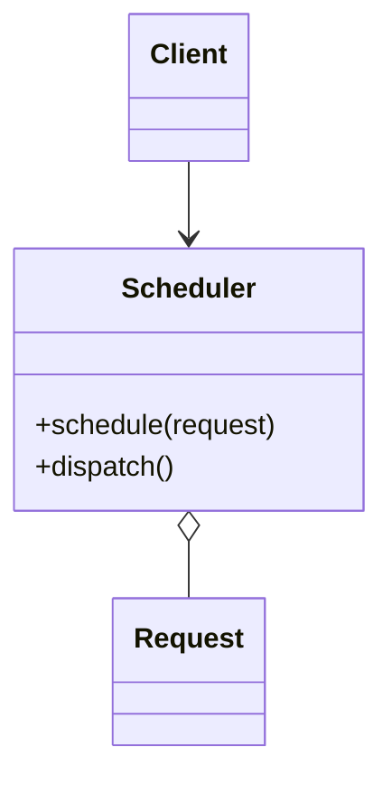
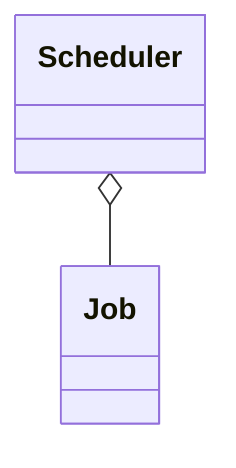

# Scheduler

**Category:** Concurrency  
**Demo:** [scheduler.typhon](scheduler.typhon)  
**Wikipedia:** [Scheduler pattern](https://en.wikipedia.org/wiki/Scheduler_pattern) · [Concurrency pattern](https://en.wikipedia.org/wiki/Concurrency_pattern)

## Intent

Control the order in which threads or requests execute a method, sequencing work through a single policy object.

## Explanation

Clients hand `Job`s to a `Scheduler`, which holds them and **dispatches** in order. Policy (FIFO here) lives in one place instead of each worker deciding when to run. The servant/`tasks` block simply runs `dispatchAll`.

## Classic structure (UML)



## This demo

`Scheduler` queues `Job` instances and prints them in enqueue order from a task.



## Real-world use cases

- Print spoolers and job queues with priority or FIFO policy.
- Animation or game loops that schedule systems in a fixed order.
- Batch pipelines that must not start step N until the scheduler releases it.

## Run

```text
python -m transpiler run examples/patterns/concurrency/scheduler.typhon
```
