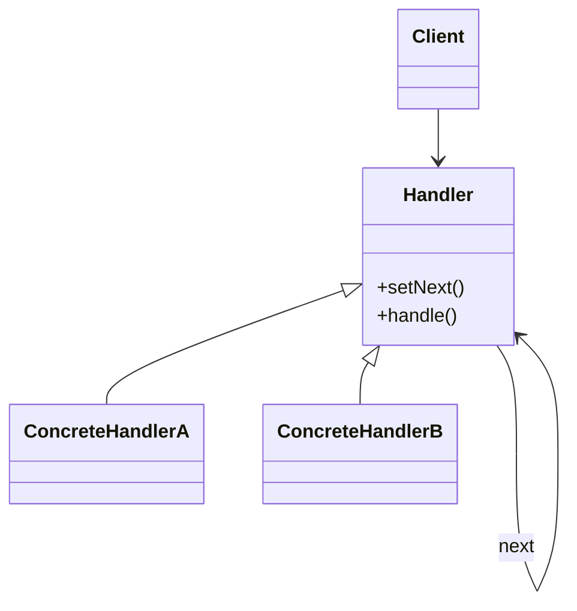
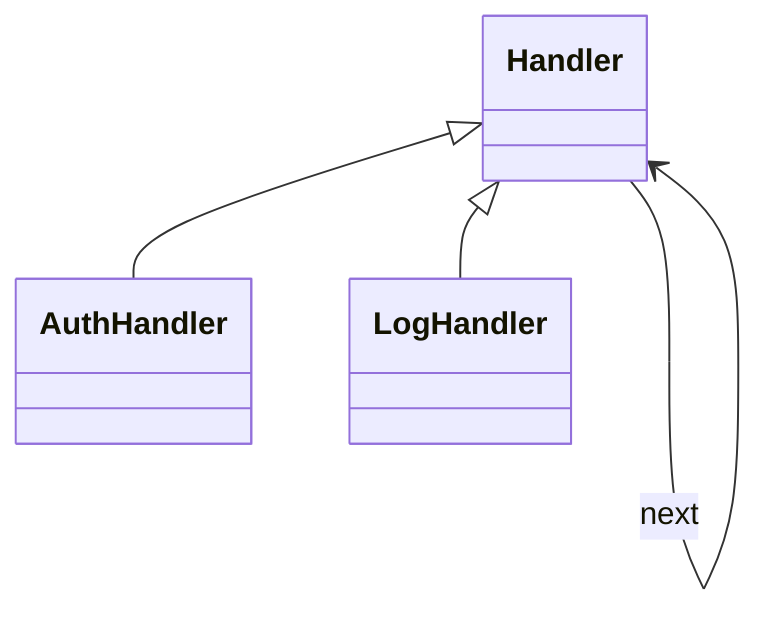

# Chain of Responsibility

**Category:** Behavioral  
**Demo:** [chain_of_responsibility.typhon](chain_of_responsibility.typhon)  
**Wikipedia:** [Chain of Responsibility pattern](https://en.wikipedia.org/wiki/Chain-of-responsibility_pattern) · [Design Patterns (book)](https://en.wikipedia.org/wiki/Design_Patterns)

## Intent

Avoid coupling the sender of a request to its receiver by giving more than one object a chance to handle the request. Chain the receiving objects and pass the request along the chain until an object handles it.

## Explanation

Each `Handler` may handle the request or forward to `next`. `AuthHandler` then `LogHandler` form a pipeline. Order matters; unhandled requests fall off the end.

## Classic structure (UML)



## This demo

`Handler` is the base; `AuthHandler` and `LogHandler` are links; the client starts at the head of the chain.



## Real-world use cases

- HTTP middleware / servlet filter chains.
- GUI event bubbling (widget → parent → window).
- Support ticket escalation (L1 → L2 → L3) until resolved.

## Run

```text
python -m transpiler run examples/patterns/design/behavioral/chain_of_responsibility.typhon
```
