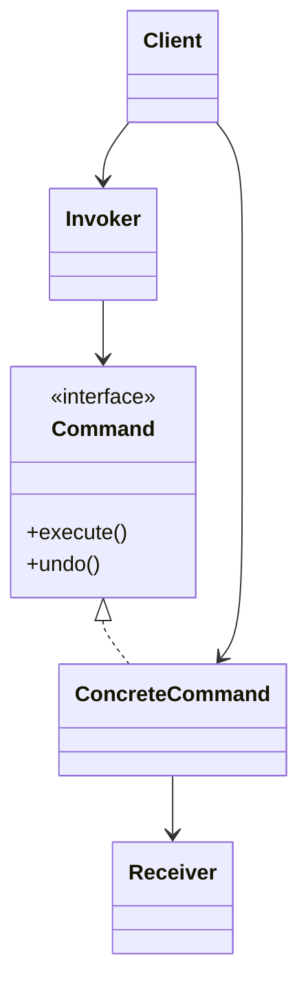
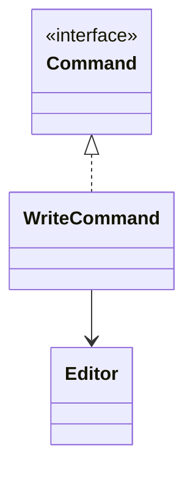

# Command

**Category:** Behavioral  
**Demo:** [command.typhon](command.typhon)  
**Wikipedia:** [Command pattern](https://en.wikipedia.org/wiki/Command_pattern) · [Design Patterns (book)](https://en.wikipedia.org/wiki/Design_Patterns)

## Intent

Encapsulate a request as an object, thereby letting you parameterize clients with different requests, queue or log requests, and support undoable operations.

## Explanation

`WriteCommand` binds an `Editor` receiver with a chunk of text. `execute` / `undo` turn edits into first-class objects you can store on a history stack.

## Classic structure (UML)



## This demo

`Command` is abstract; `WriteCommand` is ConcreteCommand; `Editor` is Receiver. The script acts as Client/Invoker calling execute then undo.



## Real-world use cases

- Editor undo/redo stacks.
- Job queues and transactional work units.
- Macro recording: store a list of commands and replay them.

## Run

```text
python -m transpiler run examples/patterns/design/behavioral/command.typhon
```
