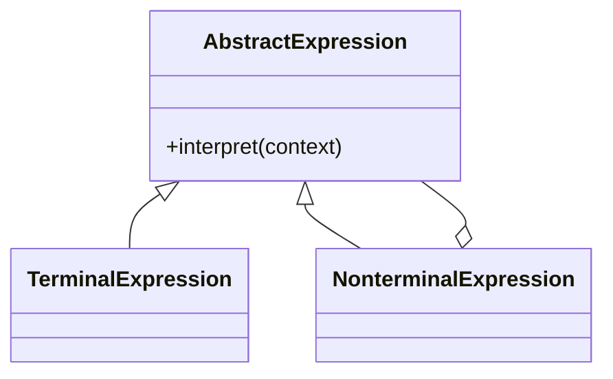
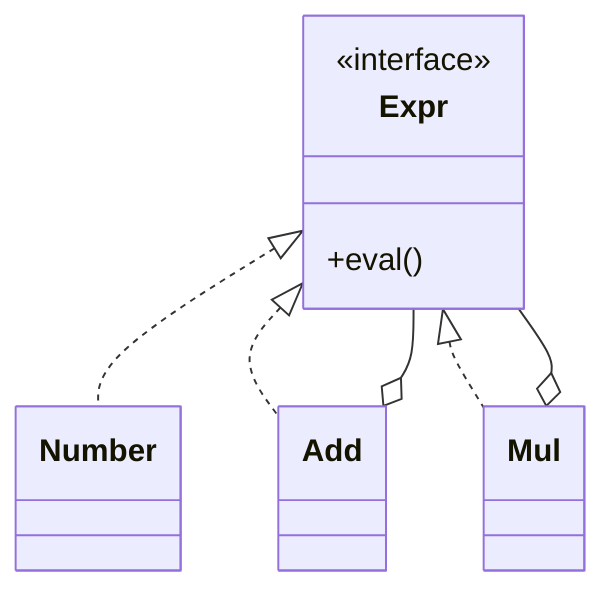

# Interpreter

**Category:** Behavioral  
**Demo:** [interpreter.typhon](interpreter.typhon)  
**Wikipedia:** [Interpreter pattern](https://en.wikipedia.org/wiki/Interpreter_pattern) · [Design Patterns (book)](https://en.wikipedia.org/wiki/Design_Patterns)

## Intent

Given a language, define a representation for its grammar along with an interpreter that uses the representation to interpret sentences in the language.

## Explanation

Expression trees (`Number`, `Add`, `Mul`) implement `eval`. Good for tiny DSLs; for large languages use a real parser/generator instead of hand-built Interpreter trees.

## Classic structure (UML)



## This demo

`Expr` is AbstractExpression; `Number` is terminal; `Add` / `Mul` are nonterminals holding child expressions.



## Real-world use cases

- Simple rule engines or boolean filters built as expression trees.
- Regex engines (conceptually) and SQL WHERE clauses as AST walkers.
- Spreadsheet formula evaluation for a tiny operator set.

## Run

```text
python -m transpiler run examples/patterns/design/behavioral/interpreter.typhon
```
