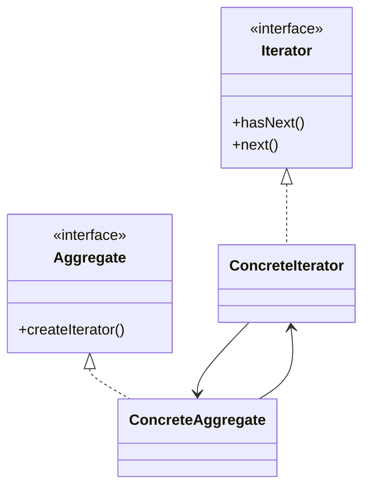
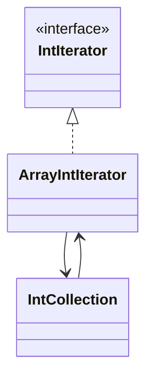

# Iterator

**Category:** Behavioral  
**Demo:** [iterator.typhon](iterator.typhon)  
**Wikipedia:** [Iterator pattern](https://en.wikipedia.org/wiki/Iterator_pattern) · [Design Patterns (book)](https://en.wikipedia.org/wiki/Design_Patterns)

## Intent

Provide a way to access the elements of an aggregate object sequentially without exposing its underlying representation.

## Explanation

`IntCollection.iterator()` returns an `ArrayIntIterator` that exposes `hasNext` / `next`. Language `loop (T x in xs)` is sugar for the same idea on built-ins; this demo shows the OO roles.

## Classic structure (UML)



## This demo

`IntIterator` / `ArrayIntIterator` are the iterator side; `IntCollection` is the aggregate.



## Real-world use cases

- Collections libraries (`Iterator`, `IEnumerable`, Java `Iterable`).
- Streaming result sets without loading the whole table into memory.
- Tree/graph walks that hide traversal order from clients.

## Run

```text
python -m transpiler run examples/patterns/design/behavioral/iterator.typhon
```
