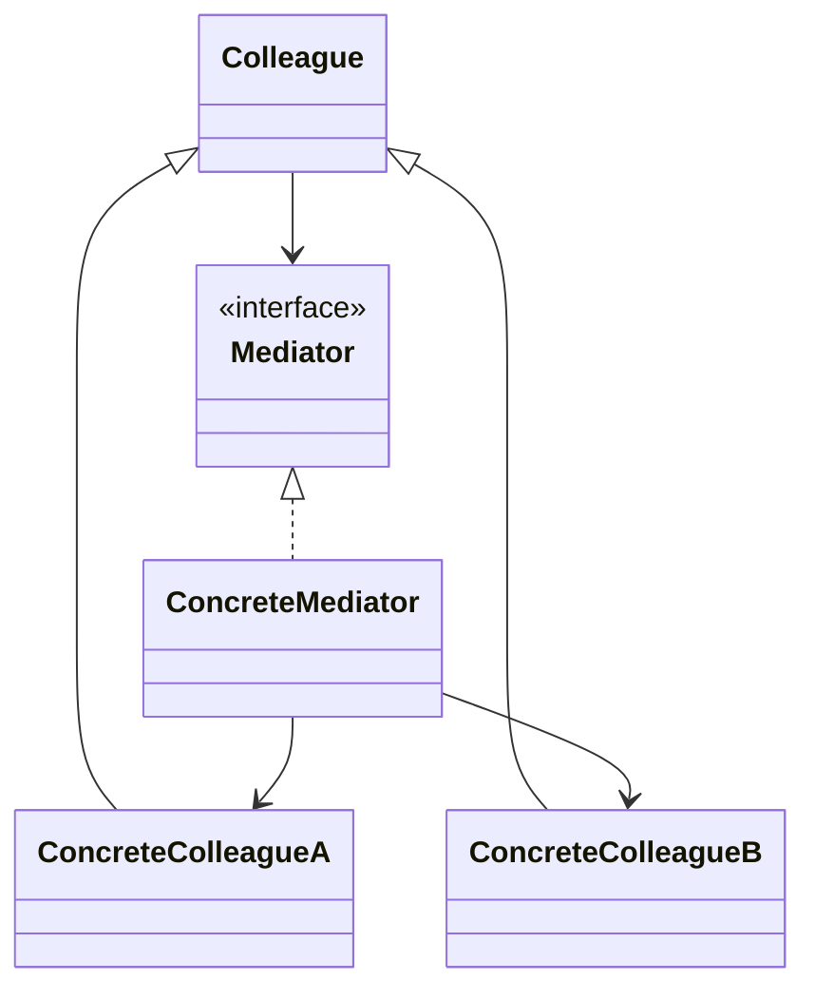
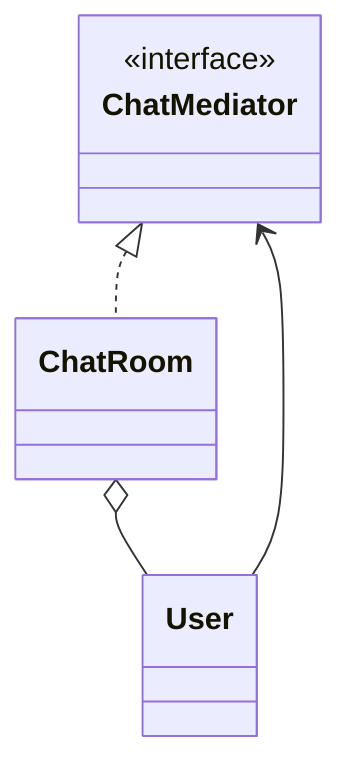

# Mediator

**Category:** Behavioral  
**Demo:** [mediator.typhon](mediator.typhon)  
**Wikipedia:** [Mediator pattern](https://en.wikipedia.org/wiki/Mediator_pattern) · [Design Patterns (book)](https://en.wikipedia.org/wiki/Design_Patterns)

## Intent

Define an object that encapsulates how a set of objects interact. Mediator promotes loose coupling by keeping objects from referring to each other explicitly.

## Explanation

`User` colleagues send messages through `ChatMediator` (`ChatRoom`) instead of holding references to every peer. Adding a user does not require rewiring all others.

## Classic structure (UML)



## This demo

`ChatMediator` / `ChatRoom` are mediator; `User` is the colleague that only knows the mediator.



## Real-world use cases

- Chat rooms / air-traffic control towers coordinating participants.
- Dialog boxes where controls notify a form mediator instead of each other.
- UI widget kits reducing N² pairwise listener wiring.

## Run

```text
python -m transpiler run examples/patterns/design/behavioral/mediator.typhon
```
