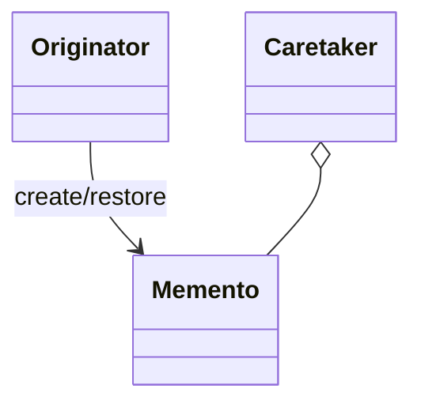
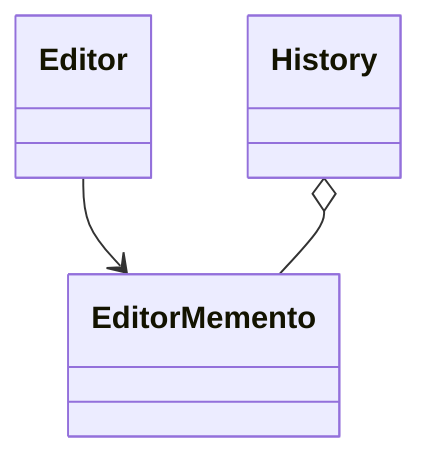

# Memento

**Category:** Behavioral  
**Demo:** [memento.typhon](memento.typhon)  
**Wikipedia:** [Memento pattern](https://en.wikipedia.org/wiki/Memento_pattern) · [Design Patterns (book)](https://en.wikipedia.org/wiki/Design_Patterns)

## Intent

Without violating encapsulation, capture and externalize an object's internal state so that the object can be restored to this state later.

## Explanation

`Editor.save()` produces an `EditorMemento`; `History` (caretaker) stores mementos; `restore` puts the editor back. The caretaker must not peek inside the memento.

## Classic structure (UML)



## This demo

`Editor` is Originator; `EditorMemento` is Memento; `History` is Caretaker.



## Real-world use cases

- Text-editor undo that snapshots document state.
- Game save checkpoints / rollback of a simulation step.
- Transactional drafts: commit keeps a memento; cancel restores it.

## Run

```text
python -m transpiler run examples/patterns/design/behavioral/memento.typhon
```
