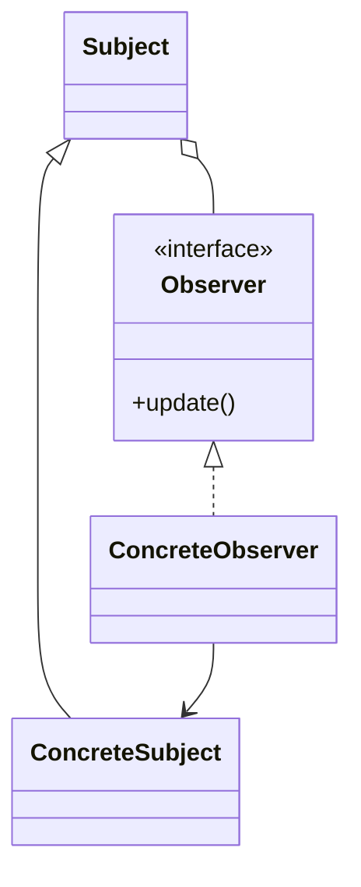
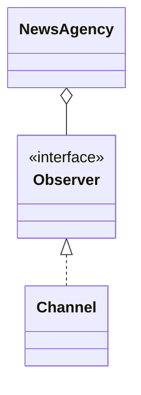

# Observer

**Category:** Behavioral  
**Demo:** [observer.typhon](observer.typhon)  
**Wikipedia:** [Observer pattern](https://en.wikipedia.org/wiki/Observer_pattern) · [Design Patterns (book)](https://en.wikipedia.org/wiki/Design_Patterns)

## Intent

Define a one-to-many dependency between objects so that when one object changes state, all its dependents are notified and updated automatically.

## Explanation

`NewsAgency` (subject) keeps a list of `Observer`s (`Channel`) and calls `update` on publish. Observers can attach/detach at runtime without the subject knowing concrete channel types.

## Classic structure (UML)



## This demo

`NewsAgency` is the subject; `Observer` / `Channel` are observers.



## Real-world use cases

- GUI event listeners and model–view updates.
- Pub/sub message buses and reactive streams.
- Stock tickers notifying multiple dashboards of price changes.

## Run

```text
python -m transpiler run examples/patterns/design/behavioral/observer.typhon
```
