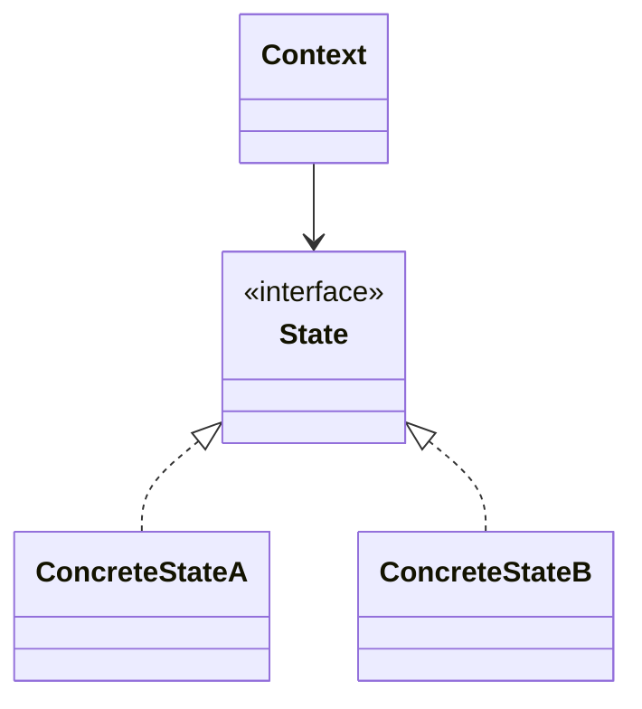
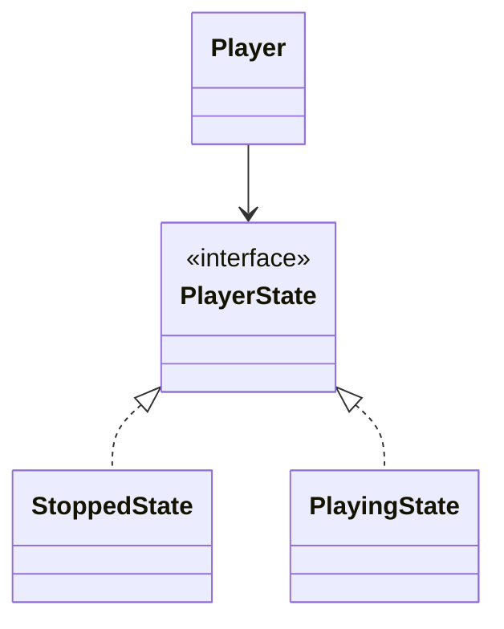

# State

**Category:** Behavioral  
**Demo:** [state.typhon](state.typhon)  
**Wikipedia:** [State pattern](https://en.wikipedia.org/wiki/State_pattern) · [Design Patterns (book)](https://en.wikipedia.org/wiki/Design_Patterns)

## Intent

Allow an object to alter its behavior when its internal state changes. The object will appear to change its class.

## Explanation

`Player` delegates `play` / `stop` to the current `PlayerState`. `StoppedState` and `PlayingState` encapsulate transitions. Avoids giant conditionals on a status enum inside the player.

## Classic structure (UML)



## This demo

`Player` is Context; `PlayerState`, `StoppedState`, `PlayingState` are the state hierarchy.



## Real-world use cases

- Media players, TCP connection state machines, order lifecycles.
- Vending machines (idle → selecting → dispensing).
- Workflow engines where each status has different allowed actions.

## Run

```text
python -m transpiler run examples/patterns/design/behavioral/state.typhon
```
