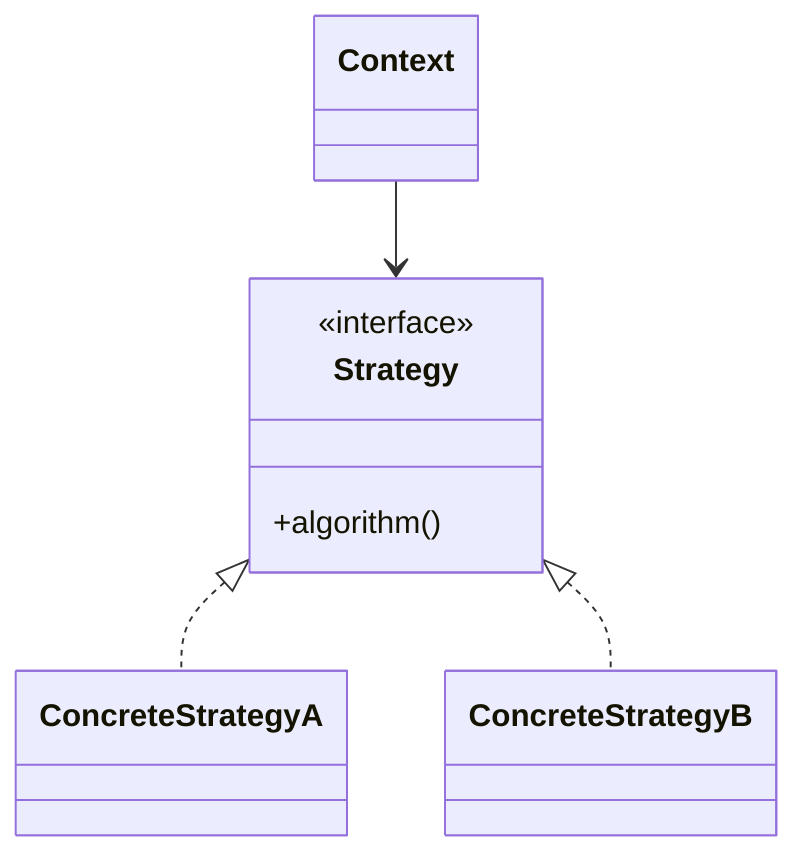
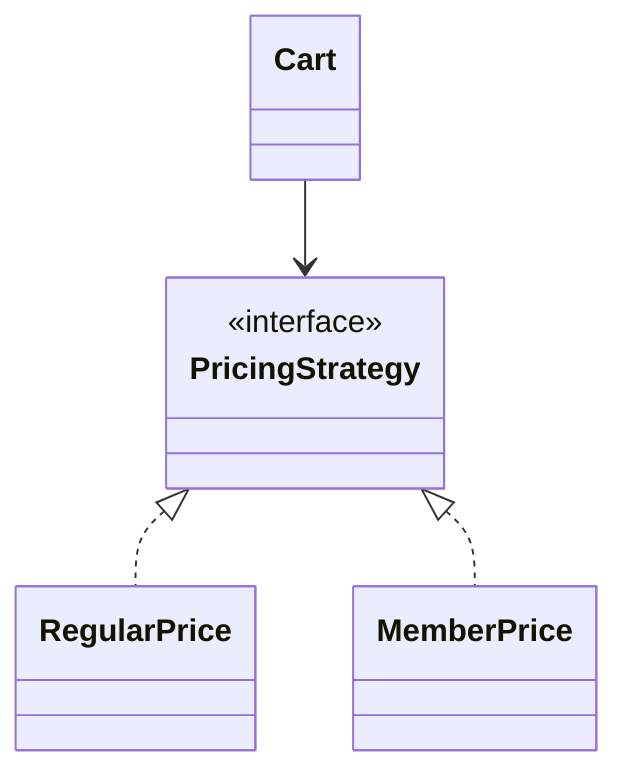

# Strategy

**Category:** Behavioral  
**Demo:** [strategy.typhon](strategy.typhon)  
**Wikipedia:** [Strategy pattern](https://en.wikipedia.org/wiki/Strategy_pattern) · [Design Patterns (book)](https://en.wikipedia.org/wiki/Design_Patterns)

## Intent

Define a family of algorithms, encapsulate each one, and make them interchangeable. Strategy lets the algorithm vary independently from clients that use it.

## Explanation

`Cart` holds a `PricingStrategy` (`RegularPrice` / `MemberPrice`) and delegates `total`. Swap the strategy at runtime without changing Cart.

## Classic structure (UML)



## This demo

`Cart` is Context; `PricingStrategy` and its subclasses are strategies.



## Real-world use cases

- Payment methods, sorting comparators, compression codecs.
- A/B test pricing or shipping-cost rules injected per customer.
- Validation strategies swapped by locale or product line.

## Run

```text
python -m transpiler run examples/patterns/design/behavioral/strategy.typhon
```
