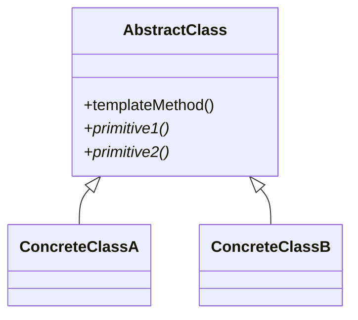
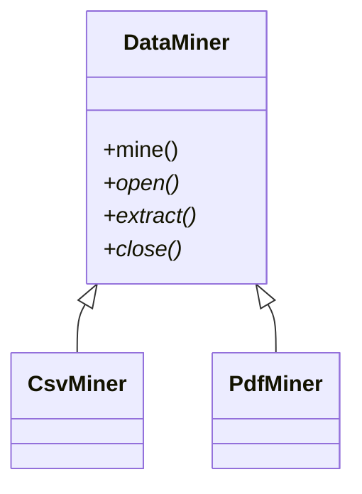

# Template Method

**Category:** Behavioral  
**Demo:** [template_method.typhon](template_method.typhon)  
**Wikipedia:** [Template Method pattern](https://en.wikipedia.org/wiki/Template_method_pattern) · [Design Patterns (book)](https://en.wikipedia.org/wiki/Design_Patterns)

## Intent

Define the skeleton of an algorithm in an operation, deferring some steps to subclasses. Template Method lets subclasses redefine certain steps of an algorithm without changing the algorithm's structure.

## Explanation

`DataMiner.mine()` is the template: open → extract → close. `CsvMiner` / `PdfMiner` override the steps. The base class owns the order; subclasses own the varying pieces.

## Classic structure (UML)



## This demo

`DataMiner.mine` is the template method; `CsvMiner` and `PdfMiner` supply the primitive steps.



## Real-world use cases

- Framework lifecycle hooks (setup → run → teardown).
- Data import pipelines with shared orchestration and format-specific reads.
- Game AI ticks with a fixed order of sense → decide → act steps.

## Run

```text
python -m transpiler run examples/patterns/design/behavioral/template_method.typhon
```
