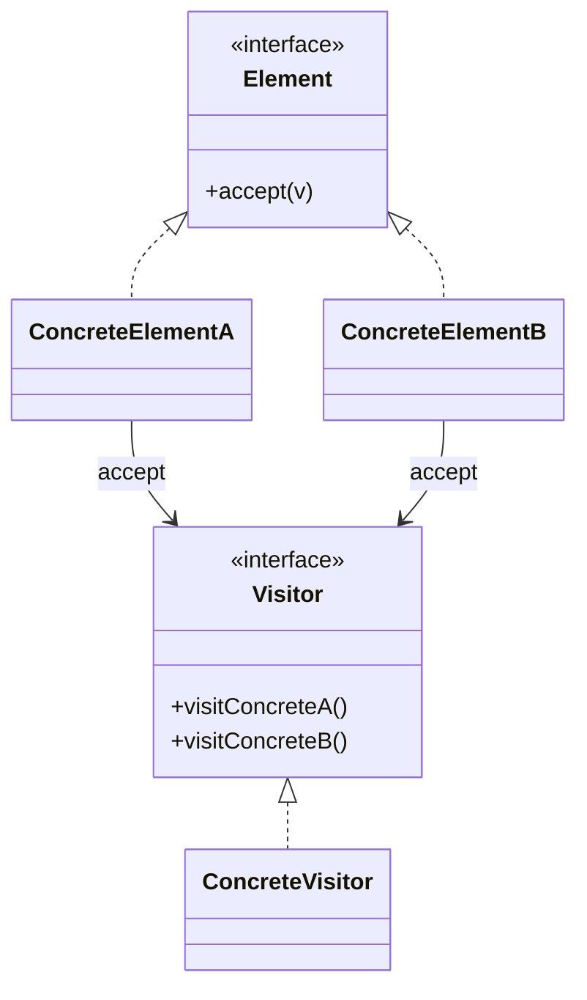
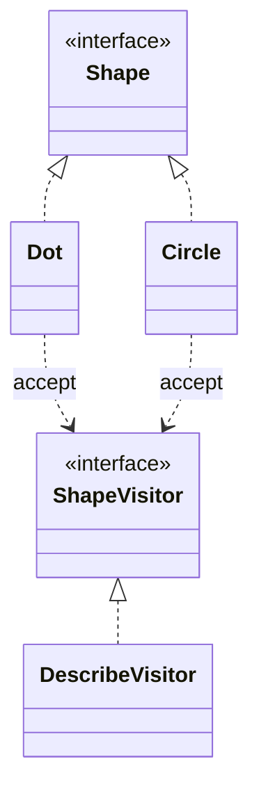

# Visitor

**Category:** Behavioral  
**Demo:** [visitor.typhon](visitor.typhon)  
**Wikipedia:** [Visitor pattern](https://en.wikipedia.org/wiki/Visitor_pattern) · [Design Patterns (book)](https://en.wikipedia.org/wiki/Design_Patterns)

## Intent

Represent an operation to be performed on the elements of an object structure. Visitor lets you define a new operation without changing the classes of the elements on which it operates.

## Explanation

Shapes implement `accept(visitor)`; `DescribeVisitor` implements `visitDot` / `visitCircle`. New operations become new visitors; element classes stay stable. Adding a new element type requires updating all visitors (the classic trade-off).

## Classic structure (UML)



## This demo

`ShapeVisitor` / `DescribeVisitor` are visitors; `Shape`, `Dot`, `Circle` are elements.



## Real-world use cases

- Compilers: AST nodes accept type-check / emit / pretty-print visitors.
- Document object models exporting to PDF vs HTML without changing nodes.
- Insurance product graphs where new reports are new visitors.

## Run

```text
python -m transpiler run examples/patterns/design/behavioral/visitor.typhon
```
