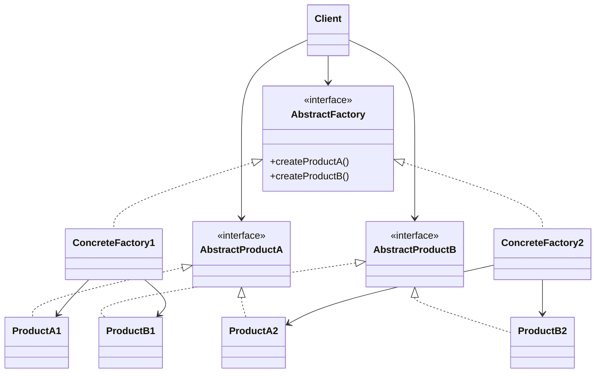
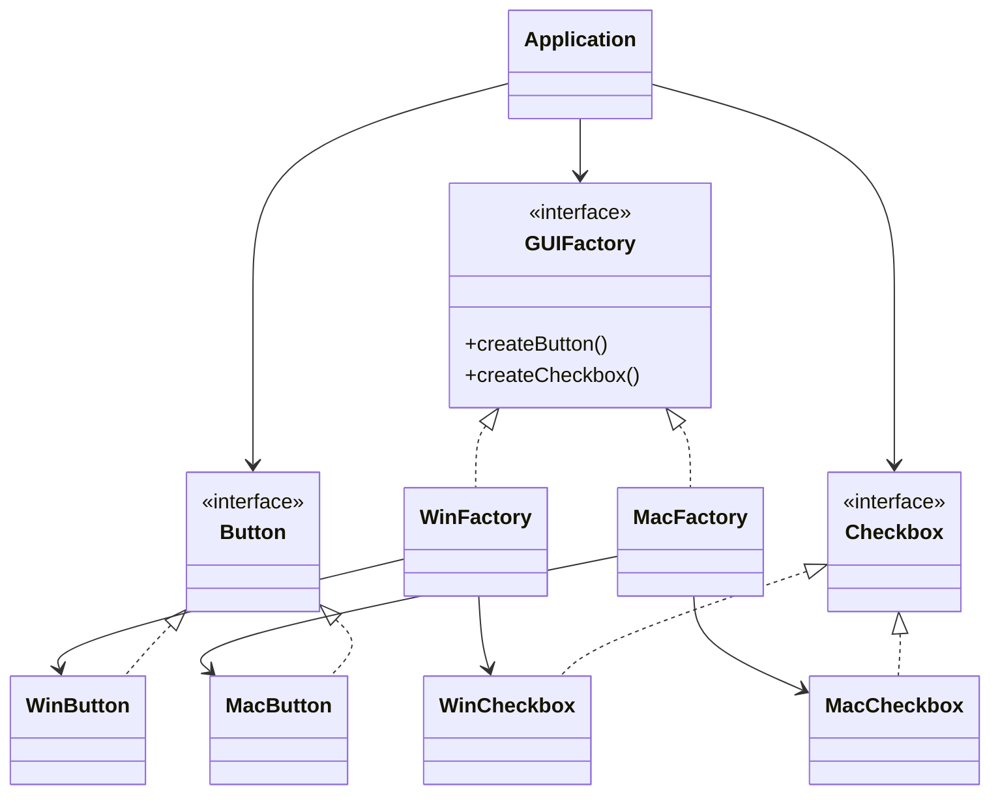

# Abstract Factory

**Category:** Creational  
**Demo:** [abstract_factory.typhon](abstract_factory.typhon)  
**Wikipedia:** [Abstract Factory pattern](https://en.wikipedia.org/wiki/Abstract_factory_pattern) · [Design Patterns (book)](https://en.wikipedia.org/wiki/Design_Patterns)

## Intent

Provide an interface for creating families of related or dependent objects without specifying their concrete classes.

## Explanation

A client asks a **factory** for products (`Button`, `Checkbox`) and never names `WinButton` or `MacButton`. Switching the factory swaps the whole family so widgets stay consistent (all Win or all Mac). Use when you need multiple product *families* that must vary together.

## Classic structure (UML)



## This demo

`GUIFactory` is the abstract factory; `WinFactory` / `MacFactory` are concrete factories. `Button` / `Checkbox` are abstract products; `WinButton`, `MacButton`, … are concrete products. `Application` is the client that only talks to the interfaces.



## Real-world use cases

- Cross-platform UI kits that must create matching controls (window, button, scrollbar) for Win / Mac / Linux.
- Database driver families (connection + statement + result-set) selected by vendor.
- Theme packs that produce consistent icons, colors, and dialogs as one family.

## Run

```text
python -m transpiler run examples/patterns/design/creational/abstract_factory.typhon
```
