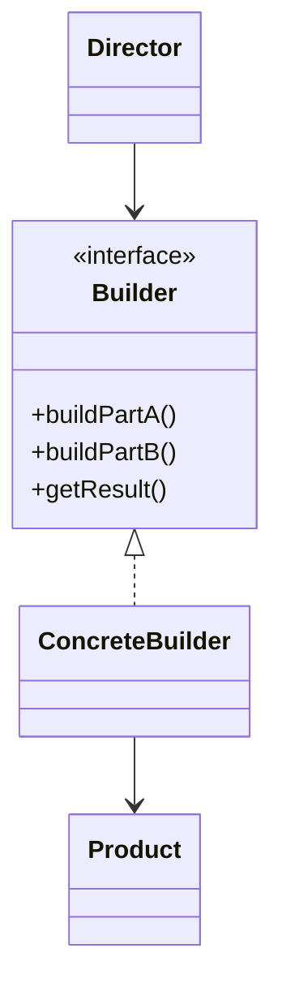
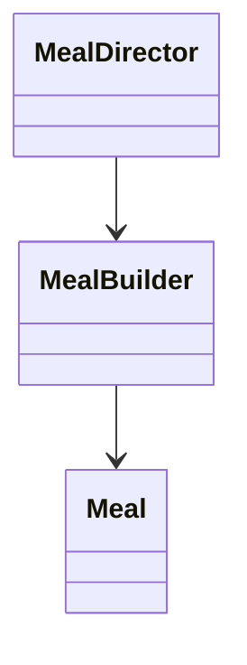

# Builder

**Category:** Creational  
**Demo:** [builder.typhon](builder.typhon)  
**Wikipedia:** [Builder pattern](https://en.wikipedia.org/wiki/Builder_pattern) · [Design Patterns (book)](https://en.wikipedia.org/wiki/Design_Patterns)

## Intent

Separate the construction of a complex object from its representation so the same construction process can create different representations.

## Explanation

A **builder** exposes step methods (`addMain`, `addSide`, …) that accumulate parts; a **director** (optional) runs a fixed recipe. The client reads a finished `Meal` only at the end. Prefer Builder when constructors would need many optional parameters or ordered steps.

## Classic structure (UML)



## This demo

`MealBuilder` is the concrete builder; `Meal` is the product; `MealDirector` runs named recipes (`vegetarian`, `kidsMeal`).



## Real-world use cases

- SQL query builders / HTTP request builders with many optional clauses.
- Document or PDF assembly (header, body sections, footer) in a fixed order.
- Test-data fixtures where readable fluent steps beat a giant constructor.

## Run

```text
python -m transpiler run examples/patterns/design/creational/builder.typhon
```
