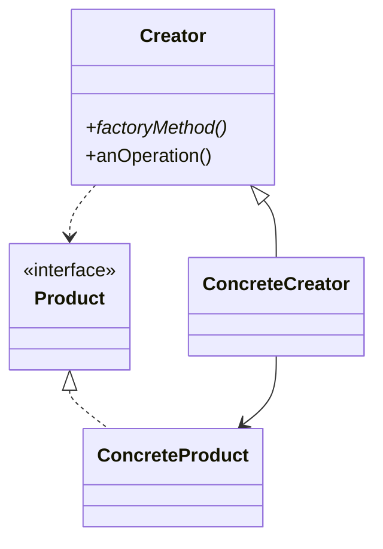
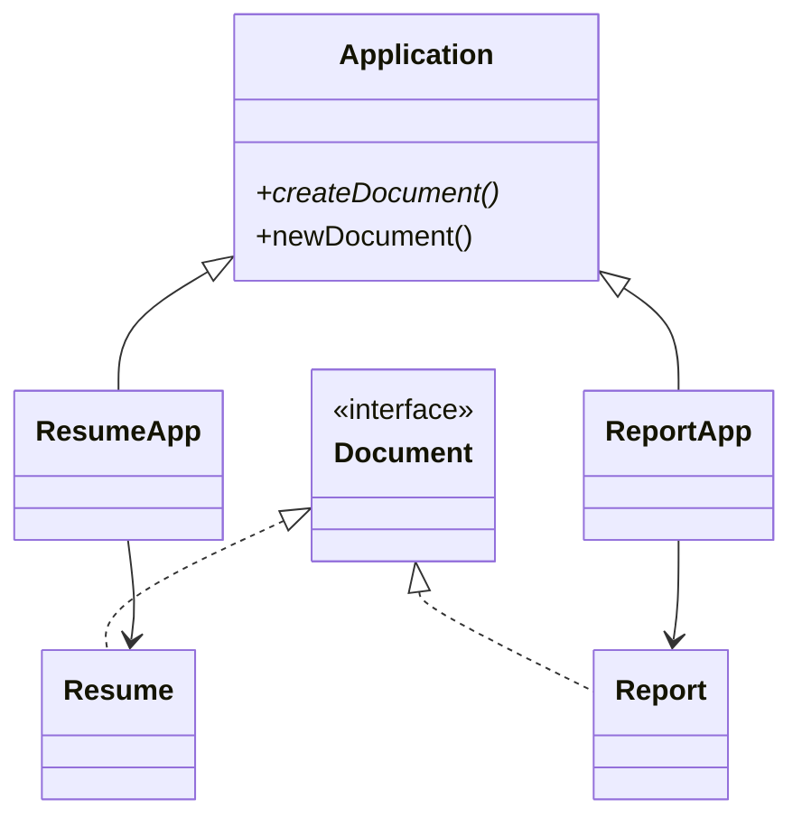

# Factory Method

**Category:** Creational  
**Demo:** [factory_method.typhon](factory_method.typhon)  
**Wikipedia:** [Factory Method pattern](https://en.wikipedia.org/wiki/Factory_method_pattern) · [Design Patterns (book)](https://en.wikipedia.org/wiki/Design_Patterns)

## Intent

Define an interface for creating an object, but let subclasses decide which class to instantiate.

## Explanation

The **creator** (`Application`) owns the workflow (`newDocument` then `open`) and calls an abstract **factory method** (`createDocument`). Subclasses (`ResumeApp`, `ReportApp`) supply the concrete `Document`. Unlike Abstract Factory, you usually create one product type per creator hierarchy.

## Classic structure (UML)



## This demo

`Application.createDocument()` is the factory method; `ResumeApp` / `ReportApp` return `Resume` / `Report`, which implement `Document`.



## Real-world use cases

- Framework plugins: base app opens a document; each plugin supplies its document type.
- Logistics apps where `createTransport()` returns Truck vs Ship subclasses.
- Game spawners where level subclasses decide which enemy type to create.

## Run

```text
python -m transpiler run examples/patterns/design/creational/factory_method.typhon
```
