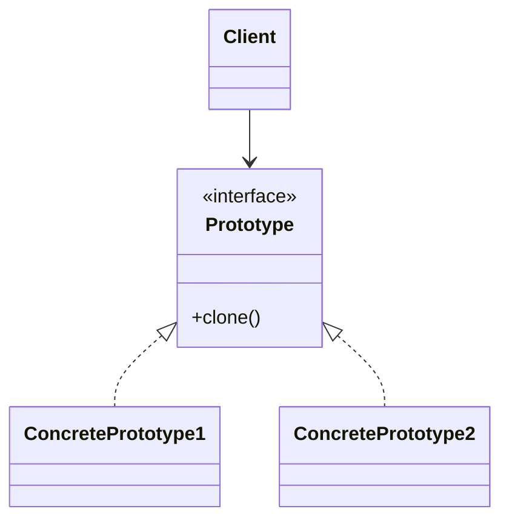
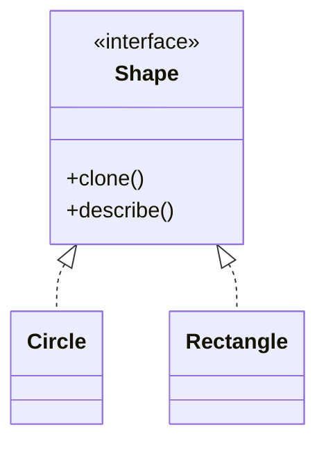

# Prototype

**Category:** Creational  
**Demo:** [prototype.typhon](prototype.typhon)  
**Wikipedia:** [Prototype pattern](https://en.wikipedia.org/wiki/Prototype_pattern) · [Design Patterns (book)](https://en.wikipedia.org/wiki/Design_Patterns)

## Intent

Specify the kinds of objects to create using a prototypical instance, and create new objects by copying this prototype.

## Explanation

Each product implements `clone()` and returns a new instance with copied state. Clients hold a prototype and clone it instead of calling constructors with many arguments. Useful when creation is expensive or when configurations are cloned and then tweaked.

## Classic structure (UML)



## This demo

`Shape` requires `clone()`; `Circle` and `Rectangle` copy their fields into new instances.



## Real-world use cases

- Graphic editors: duplicate a selected shape with all style properties.
- Configuration templates cloned per environment, then overridden lightly.
- Avoiding costly re-init (parsed schemas, pre-warmed caches) by copying.

## Run

```text
python -m transpiler run examples/patterns/design/creational/prototype.typhon
```
