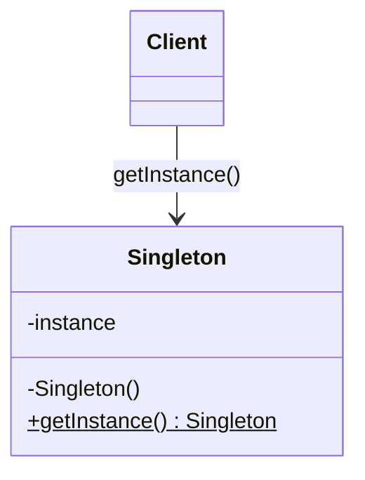
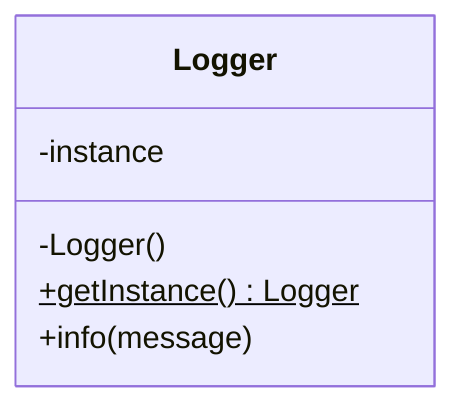

# Singleton

**Category:** Creational  
**Demo:** [singleton.typhon](singleton.typhon)  
**Wikipedia:** [Singleton pattern](https://en.wikipedia.org/wiki/Singleton_pattern) · [Design Patterns (book)](https://en.wikipedia.org/wiki/Design_Patterns)

## Intent

Ensure a class has only one instance and provide a global point of access to it.

## Explanation

`getInstance()` lazily creates and returns the sole `Logger`. Both callers share the same object (write count accumulates). Classic form is shown for literacy; in applications prefer [Dependency Injection](../../general/dependency_injection.md) (constructor injection / a composition root) over a hidden global.

## Classic structure (UML)



## This demo

`Logger` is the singleton; `getInstance()` is the global access point; the constructor is private.



## Real-world use cases

- Process-wide logging or metrics sinks (historically; often replaced by [DI](../../general/dependency_injection.md)).
- Hardware device drivers that must own a single connection handle.
- Caches or thread pools that must not be constructed twice by accident.

## Run

```text
python -m transpiler run examples/patterns/design/creational/singleton.typhon
```
