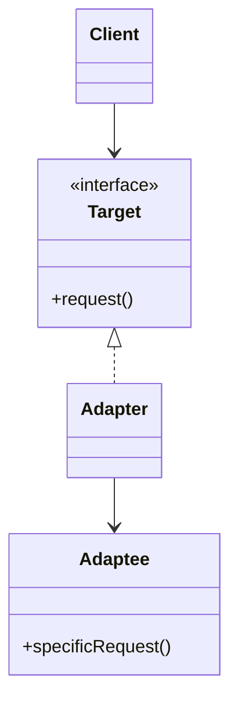
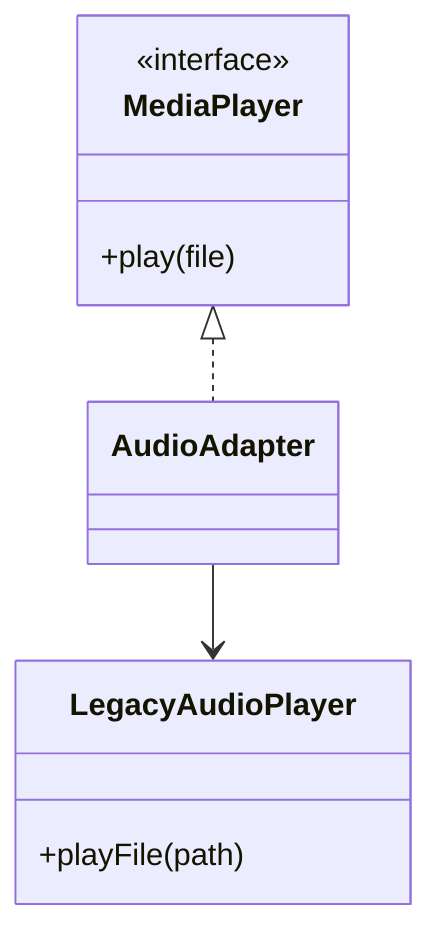

# Adapter

**Category:** Structural  
**Demo:** [adapter.typhon](adapter.typhon)  
**Wikipedia:** [Adapter pattern](https://en.wikipedia.org/wiki/Adapter_pattern) · [Design Patterns (book)](https://en.wikipedia.org/wiki/Design_Patterns)

## Intent

Convert the interface of a class into another interface clients expect. Adapter lets classes work together that could not otherwise because of incompatible interfaces.

## Explanation

The client depends on `MediaPlayer.play`. `LegacyAudioPlayer` speaks a different API (`playFile`). `AudioAdapter` implements the target interface and **delegates** to the legacy player — a classic object adapter.

## Classic structure (UML)



## This demo

`MediaPlayer` is Target; `LegacyAudioPlayer` is Adaptee; `AudioAdapter` is Adapter.



## Real-world use cases

- Wrapping a third-party payment SDK behind your own `PaymentGateway` interface.
- XML legacy services adapted to a JSON/domain API your app already uses.
- Making an old collection API look like a modern `Iterator` / stream.

## Run

```text
python -m transpiler run examples/patterns/design/structural/adapter.typhon
```
