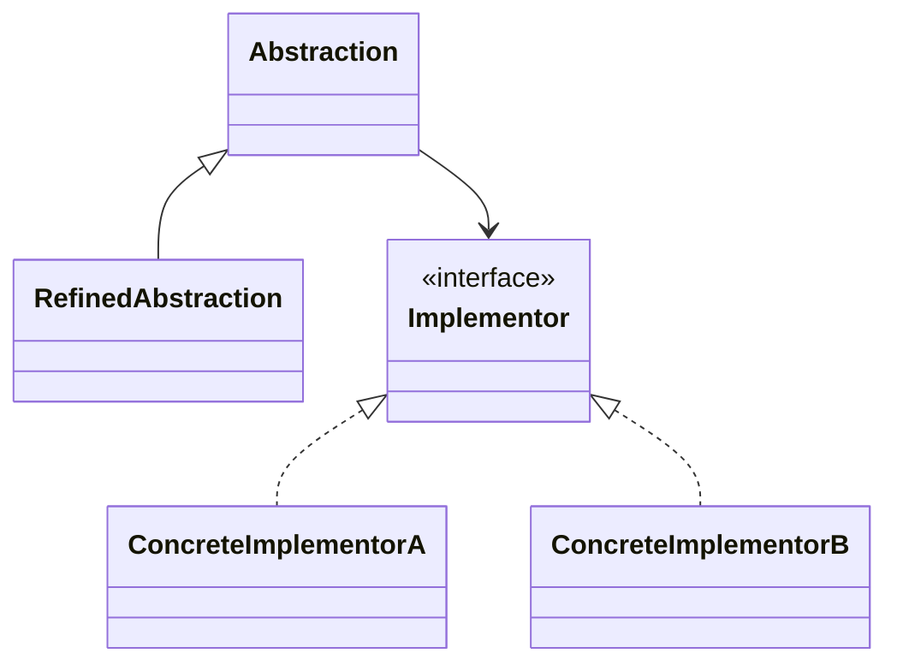
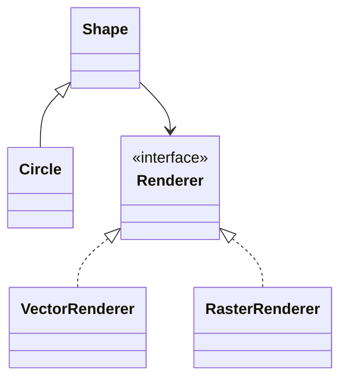

# Bridge

**Category:** Structural  
**Demo:** [bridge.typhon](bridge.typhon)  
**Wikipedia:** [Bridge pattern](https://en.wikipedia.org/wiki/Bridge_pattern) · [Design Patterns (book)](https://en.wikipedia.org/wiki/Design_Patterns)

## Intent

Decouple an abstraction from its implementation so the two can vary independently.

## Explanation

`Shape` (abstraction) holds a `Renderer` (implementor). You can add new shapes or new renderers without an N×M class explosion. The bridge is the composition link from abstraction to implementor.

## Classic structure (UML)



## This demo

`Shape` / `Circle` are abstraction; `Renderer`, `VectorRenderer`, `RasterRenderer` are the implementor hierarchy.



## Real-world use cases

- GUI widgets drawn via OpenGL vs Canvas vs SVG backends.
- Remote vs local device drivers behind the same device abstraction.
- Messaging: Notification abstraction over Email / SMS / Push implementors.

## Run

```text
python -m transpiler run examples/patterns/design/structural/bridge.typhon
```
