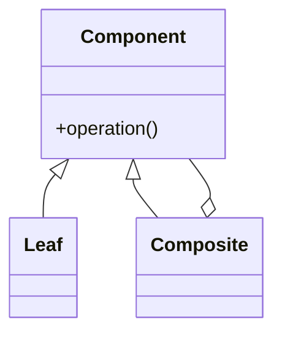
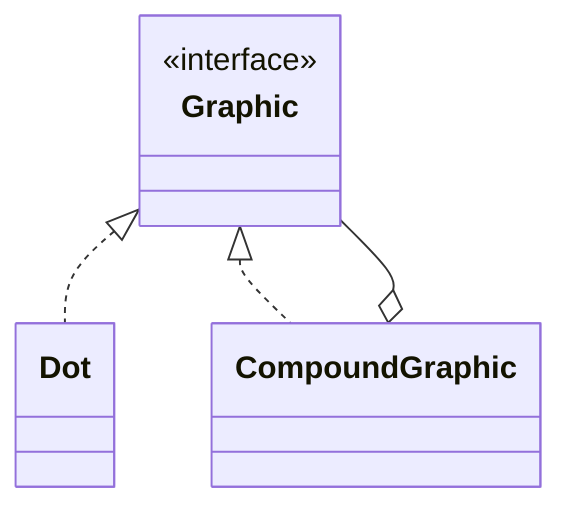

# Composite

**Category:** Structural  
**Demo:** [composite.typhon](composite.typhon)  
**Wikipedia:** [Composite pattern](https://en.wikipedia.org/wiki/Composite_pattern) · [Design Patterns (book)](https://en.wikipedia.org/wiki/Design_Patterns)

## Intent

Compose objects into tree structures to represent part-whole hierarchies. Composite lets clients treat individual objects and compositions of objects uniformly.

## Explanation

`Graphic.draw()` works on a leaf `Dot` and on a `CompoundGraphic` that holds children. Clients recurse the tree with one API. Use when UI scenes, file systems, or menus are naturally hierarchical.

## Classic structure (UML)



## This demo

`Graphic` is Component; `Dot` is Leaf; `CompoundGraphic` is Composite and owns child `Graphic`s.



## Real-world use cases

- Scene graphs / DOM-like UI trees (panel containing buttons and nested panels).
- File-system browsers (files and folders share a node interface).
- Menu bars with nested submenus treated as menu items.

## Run

```text
python -m transpiler run examples/patterns/design/structural/composite.typhon
```
