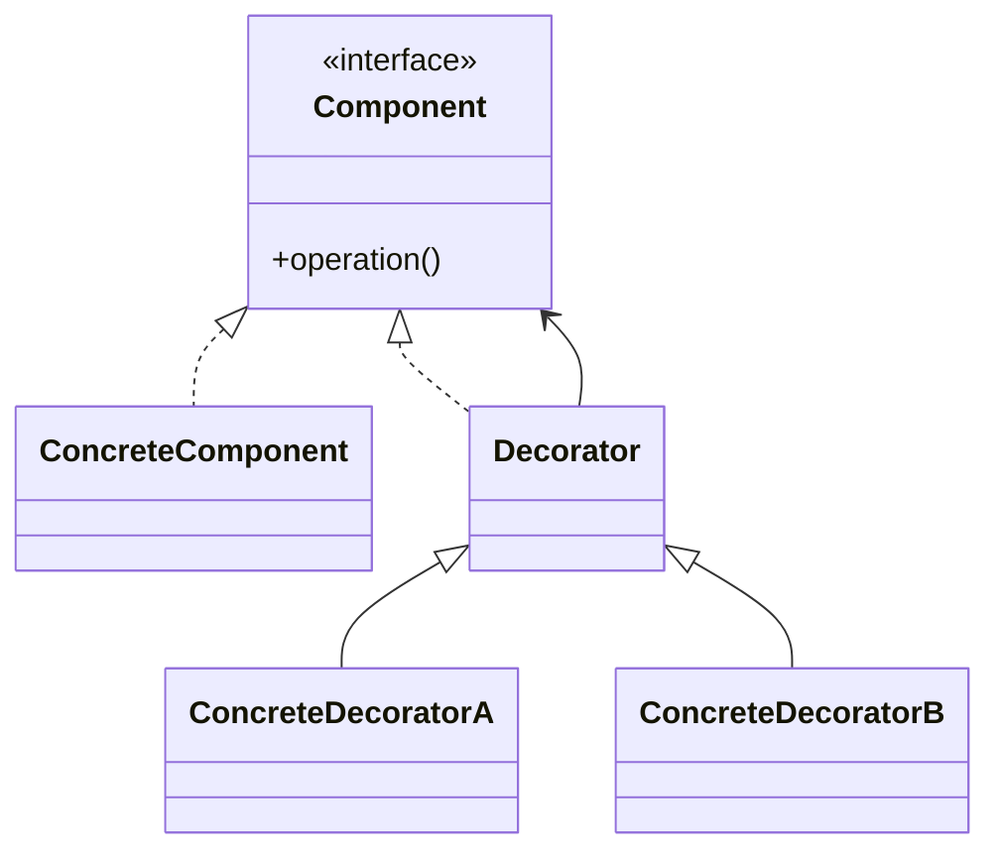
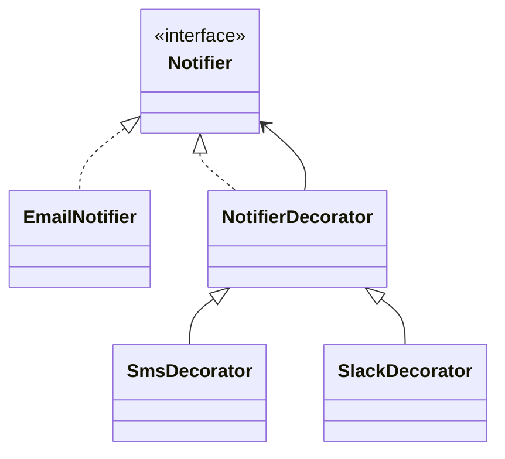

# Decorator

**Category:** Structural  
**Demo:** [decorator.typhon](decorator.typhon)  
**Wikipedia:** [Decorator pattern](https://en.wikipedia.org/wiki/Decorator_pattern) · [Design Patterns (book)](https://en.wikipedia.org/wiki/Design_Patterns)

## Intent

Attach additional responsibilities to an object dynamically. Decorators provide a flexible alternative to subclassing for extending functionality.

## Explanation

Decorators implement the same interface as the wrappee and forward `send`, adding behavior before/after. Stacking `SmsDecorator` and `SlackDecorator` around `EmailNotifier` composes channels without new subclasses for every combination.

## Classic structure (UML)



## This demo

`Notifier` is Component; `EmailNotifier` is ConcreteComponent; `NotifierDecorator` is Decorator; `SmsDecorator` / `SlackDecorator` are concrete decorators.



## Real-world use cases

- Java I/O streams (`BufferedInputStream` wrapping `FileInputStream`).
- HTTP middleware / servlet filters that wrap a handler.
- UI borders/scrollbars wrapping a core widget without subclassing it.

## Run

```text
python -m transpiler run examples/patterns/design/structural/decorator.typhon
```
