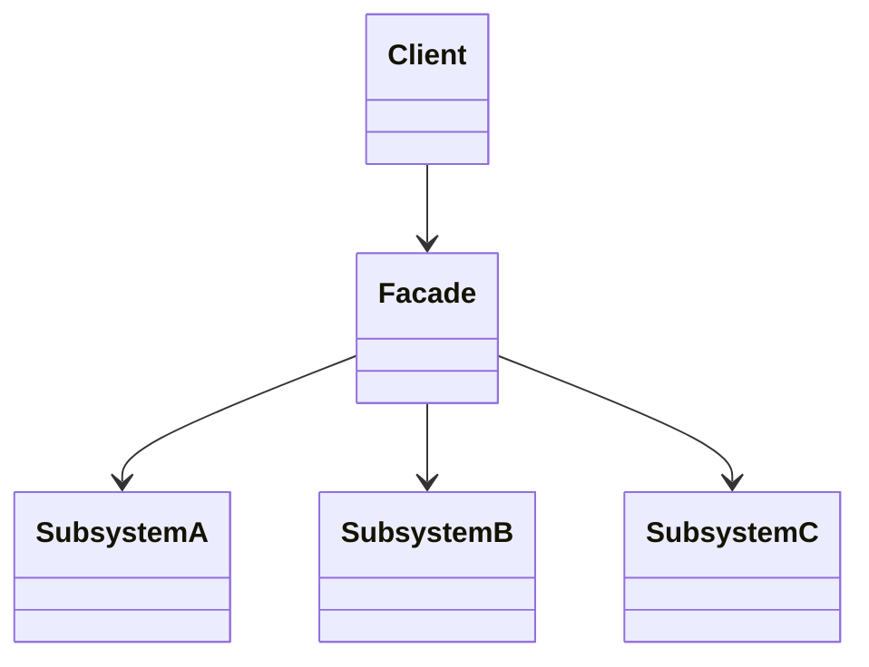
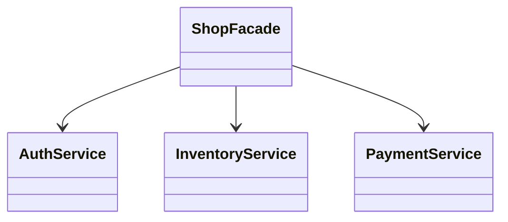

# Facade

**Category:** Structural  
**Demo:** [facade.typhon](facade.typhon)  
**Wikipedia:** [Facade pattern](https://en.wikipedia.org/wiki/Facade_pattern) · [Design Patterns (book)](https://en.wikipedia.org/wiki/Design_Patterns)

## Intent

Provide a unified interface to a set of interfaces in a subsystem. Facade defines a higher-level interface that makes the subsystem easier to use.

## Explanation

`ShopFacade.placeOrder` sequences auth, inventory, and payment so callers do not wire those services themselves. Facade does not hide the subsystem forever — it is a convenience entry point.

## Classic structure (UML)



## This demo

`ShopFacade` is the facade; `AuthService`, `InventoryService`, and `PaymentService` are subsystem classes.



## Real-world use cases

- Library entry points that hide compile / link / load steps behind `build()`.
- Home-automation “evening mode” that turns on lights, locks doors, sets thermostat.
- Checkout APIs that coordinate cart, tax, payment, and email internally.

## Run

```text
python -m transpiler run examples/patterns/design/structural/facade.typhon
```
