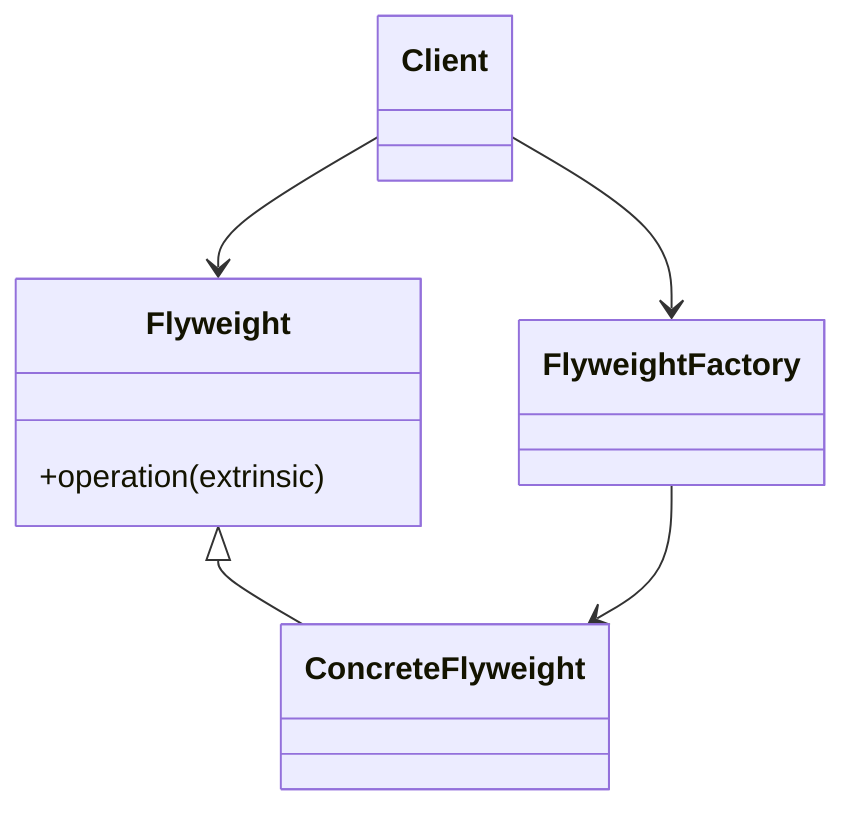
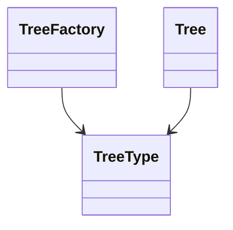

# Flyweight

**Category:** Structural  
**Demo:** [flyweight.typhon](flyweight.typhon)  
**Wikipedia:** [Flyweight pattern](https://en.wikipedia.org/wiki/Flyweight_pattern) · [Design Patterns (book)](https://en.wikipedia.org/wiki/Design_Patterns)

## Intent

Use sharing to support large numbers of fine-grained objects efficiently.

## Explanation

**Intrinsic** state (shared `TreeType` name/color) lives in flyweights from `TreeFactory`. **Extrinsic** state (x, y) lives on each `Tree` instance. Thousands of trees reuse few types instead of duplicating heavy data.

## Classic structure (UML)



## This demo

`TreeType` is the flyweight; `TreeFactory` caches types by name; `Tree` holds extrinsic coordinates and a shared type.



## Real-world use cases

- Text editors: one glyph object per character style reused across the document.
- Game maps: shared mesh/texture assets with per-instance transforms.
- Particle systems sharing material definitions across many particles.

## Run

```text
python -m transpiler run examples/patterns/design/structural/flyweight.typhon
```
