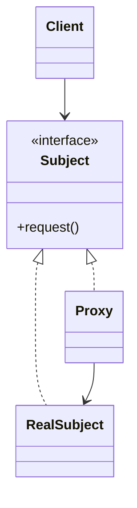
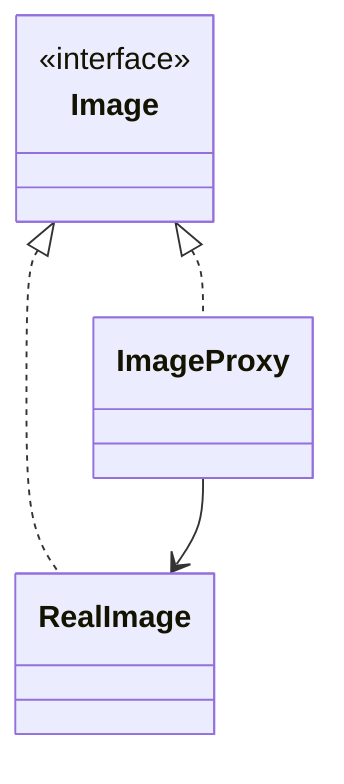

# Proxy

**Category:** Structural  
**Demo:** [proxy.typhon](proxy.typhon)  
**Wikipedia:** [Proxy pattern](https://en.wikipedia.org/wiki/Proxy_pattern) · [Design Patterns (book)](https://en.wikipedia.org/wiki/Design_Patterns)

## Intent

Provide a surrogate or placeholder for another object to control access to it.

## Explanation

`ImageProxy` implements `Image` and creates `RealImage` only on first `display` (virtual / lazy proxy). Other proxy kinds add access control, remote stubs, or logging — same shape, different reason.

## Classic structure (UML)



## This demo

`Image` is Subject; `RealImage` is RealSubject; `ImageProxy` is Proxy and holds a nullable real image until needed.



## Real-world use cases

- Lazy-loading images or large documents until first paint.
- Protection proxies enforcing permissions before calling a service.
- Remote proxies / stubs that forward calls across a network.

## Run

```text
python -m transpiler run examples/patterns/design/structural/proxy.typhon
```
