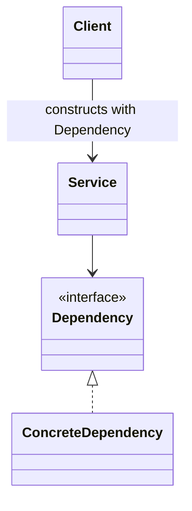
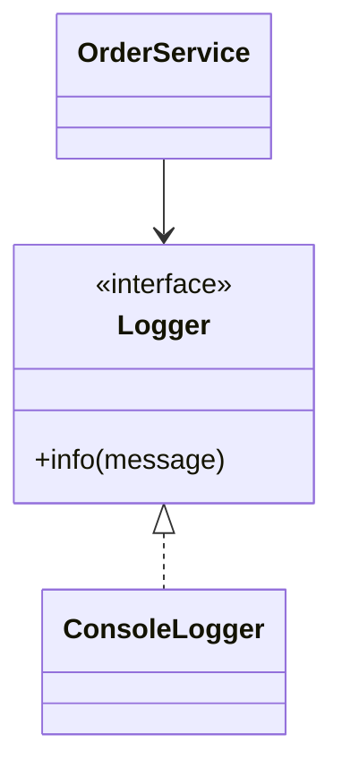

# Dependency Injection

**Category:** General (not GoF)  
**Demo:** [dependency_injection.typhon](dependency_injection.typhon)  
**Wikipedia:** [Dependency injection](https://en.wikipedia.org/wiki/Dependency_injection) · [Inversion of control](https://en.wikipedia.org/wiki/Inversion_of_control)

## Intent

Give an object its collaborators from the outside so it does not construct or
look up hidden globals itself. The usual teaching form is **constructor
injection**.

## Explanation

`OrderService` depends on a `Logger` **interface**. The composition root
creates a `ConsoleLogger` and passes it into `OrderService(...)`. The service
never calls `getInstance()` or `new` on a concrete logger. That is Dependency
Injection (DI); Inversion of Control (IoC) is the broader idea that control of
wiring moves outward.

Prefer this over [Singleton](../creational/singleton.typhon) for application
services: tests can inject a fake logger; production wires a real one once.

## Classic structure (UML)



## This demo

`Logger` is the dependency port; `ConsoleLogger` is the concrete; `OrderService`
is the client of the port; the script bottom is the composition root.



## Real-world use cases

- Web apps: controllers receive repositories / use-cases via constructors.
- Desktop apps: a composition root wires UI to domain services.
- Unit tests: inject fakes/mocks without changing production classes.

## Prompting an AI

**Say this:** “Inject `Logger` into `OrderService` via the constructor. Do not
look up a global logger.”

**Not this:** “Use a Service Locator / `Services.getLogger()`.”

**Confusion to avoid:** Dependency Injection ≠ Service Locator.

## Run

```text
python -m transpiler run examples/patterns/general/dependency_injection.typhon
```
