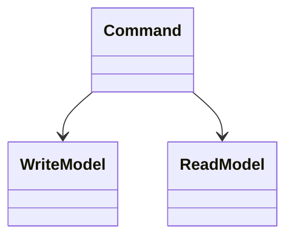
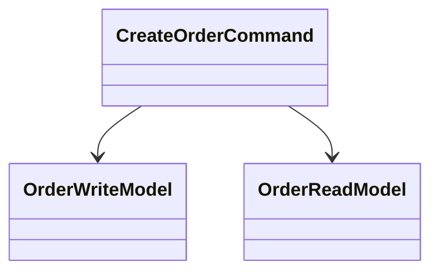

# CQRS (Command Query Responsibility Segregation)

**Category:** Messaging  
**Demo:** [cqrs.typhon](cqrs.typhon)  
**Wikipedia:** [Command Query Responsibility Segregation](https://en.wikipedia.org/wiki/Command_Query_Responsibility_Segregation)

## Intent

Use different models to **change** state (commands) and to **read** it (queries).

## Explanation

`OrderWriteModel` stores authoritative status; `OrderReadModel` holds a projected
summary updated by `CreateOrderCommand`. Teaching form in one process.

## Classic structure (UML)



## This demo



## Real-world use cases

- High-read dashboards with denormalized query stores.
- Event-sourced systems projecting read models.

## Run

```text
python -m transpiler run examples/patterns/messaging/cqrs.typhon
```
