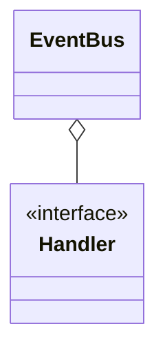
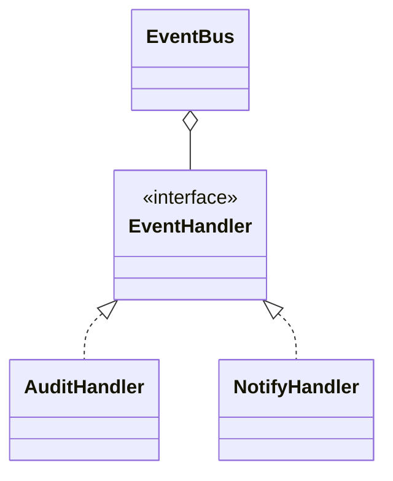

# Event-driven architecture

**Category:** Messaging  
**Demo:** [event_driven.typhon](event_driven.typhon)  
**Wikipedia:** [Event-driven architecture](https://en.wikipedia.org/wiki/Event-driven_architecture)

## Intent

Components react to **events** (facts that happened) rather than calling each
other through a central orchestrator.

## Explanation

An in-process `EventBus` fans out to `EventHandler`s. Production systems often
use durable brokers; this demo shows the shape. Related: design
[Observer](../design/behavioral/observer.md).

## Classic structure (UML)



## This demo



## Real-world use cases

- OrderPlaced → email, inventory, analytics.
- Microservice choreography via an event bus.

## Run

```text
python -m transpiler run examples/patterns/messaging/event_driven.typhon
```
