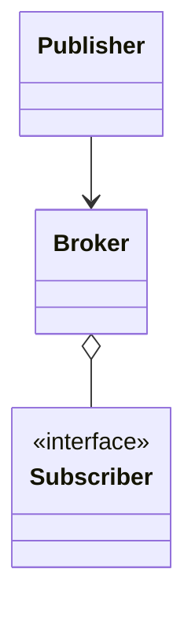
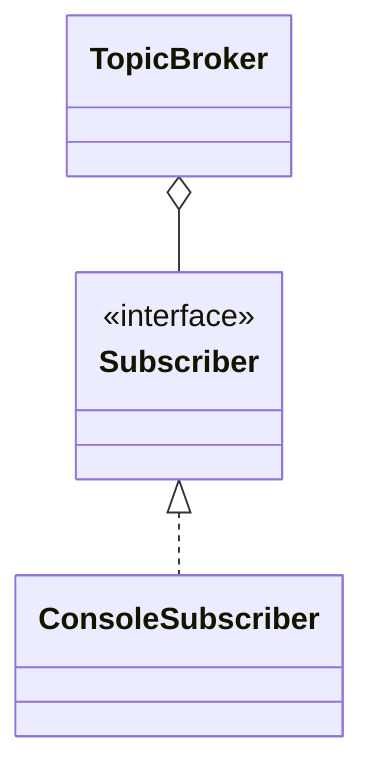

# Publish–subscribe

**Category:** Messaging  
**Demo:** [publish_subscribe.typhon](publish_subscribe.typhon)  
**Wikipedia:** [Publish–subscribe pattern](https://en.wikipedia.org/wiki/Publish%E2%80%93subscribe_pattern)

## Intent

Publishers emit messages on **topics**; subscribers receive only topics they
care about, without knowing publishers.

## Explanation

`TopicBroker` maps topic → list of `Subscriber`s. Differs from plain Observer by
explicit topic routing. Broker products (Kafka, MQTT) deferred.

## Classic structure (UML)



## This demo



## Real-world use cases

- Chat channels / notification topics.
- Market-data feeds by symbol.

## Run

```text
python -m transpiler run examples/patterns/messaging/publish_subscribe.typhon
```
