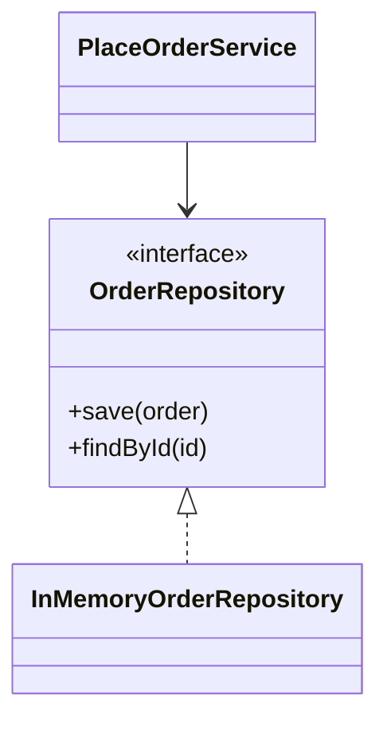

# Repository

**Category:** Persistence  
**Demo:** [repository.typhon](repository.typhon)  
**Wikipedia:** [Repository pattern](https://en.wikipedia.org/wiki/Repository_pattern)  
**Related:** [hexagonal](../architectural/hexagonal.md) · [Dependency Injection](../general/dependency_injection.md) · shop `repositories.typhon`

## Intent

Give the domain a **collection-like port** for loading and saving one
**Aggregate** (usually by aggregate-root id), so application code does not talk
to SQL, files, or raw `dict` maps directly.

Book: [§10.1 Aggregate](../../../book/chapter_9_1_app_shape.md) — Aggregate ≠
`entity` keyword; this demo’s `Order` is a **single-entity** Aggregate for
brevity (shops often include line items inside the same boundary).

## Explanation

`OrderRepository` is the port. `InMemoryOrderRepository` is an adapter.
`PlaceOrderService` depends only on the port (constructor injection). Swapping
memory for MySQL later does not change the service.

## Classic structure (UML)



## Real-world use cases

- REST handlers call a use-case; the use-case calls a repository.
- Tests inject an in-memory repository instead of a database.

## Prompting an AI

**Say this:** “Add an `OrderRepository` interface with `save` / `findById`. The
use-case takes the repository in its constructor. Provide an in-memory adapter.”

**Not this:** “Just keep orders in a global dict inside the HTTP handler.”

**Confusion to avoid:** Repository ≠ Unit of Work (UoW coordinates a transaction;
the repository is the persistence API). Aggregate ≠ entity keyword (see book
§10.1). Aggregate ≠ Repository (cluster vs port).

## Run

```text
python -m transpiler run examples/patterns/persistence/repository.typhon
```
