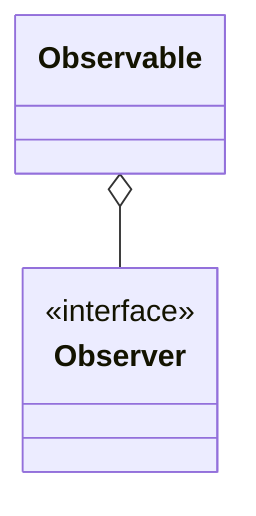
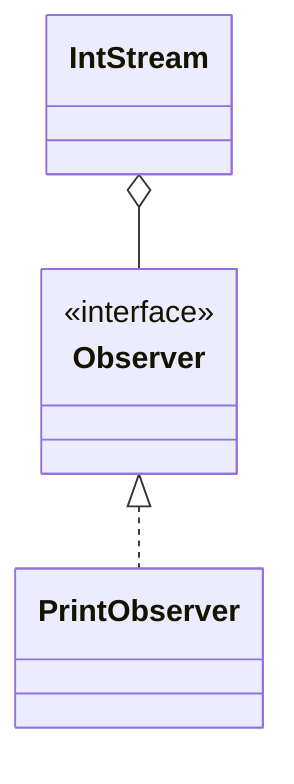

# Reactive (teaching push streams)

**Category:** Reactive  
**Demo:** [reactive.typhon](reactive.typhon)  
**Wikipedia:** [Reactive programming](https://en.wikipedia.org/wiki/Reactive_programming)

## Intent

Push values to subscribers over time (`onNext` / `onComplete`).

## Explanation

`IntStream` is a tiny Observable stand-in. **Honest note:** Typhon has no ReactiveX
operators or backpressure; `tasks`/`await` are structured concurrency, not this
library model. This demo teaches the push-subscription idea only.

## Classic structure (UML)



## This demo



## Real-world use cases

- UI event streams / Rx libraries.
- Sensor telemetry pipelines.

## Run

```text
python -m transpiler run examples/patterns/reactive/reactive.typhon
```
